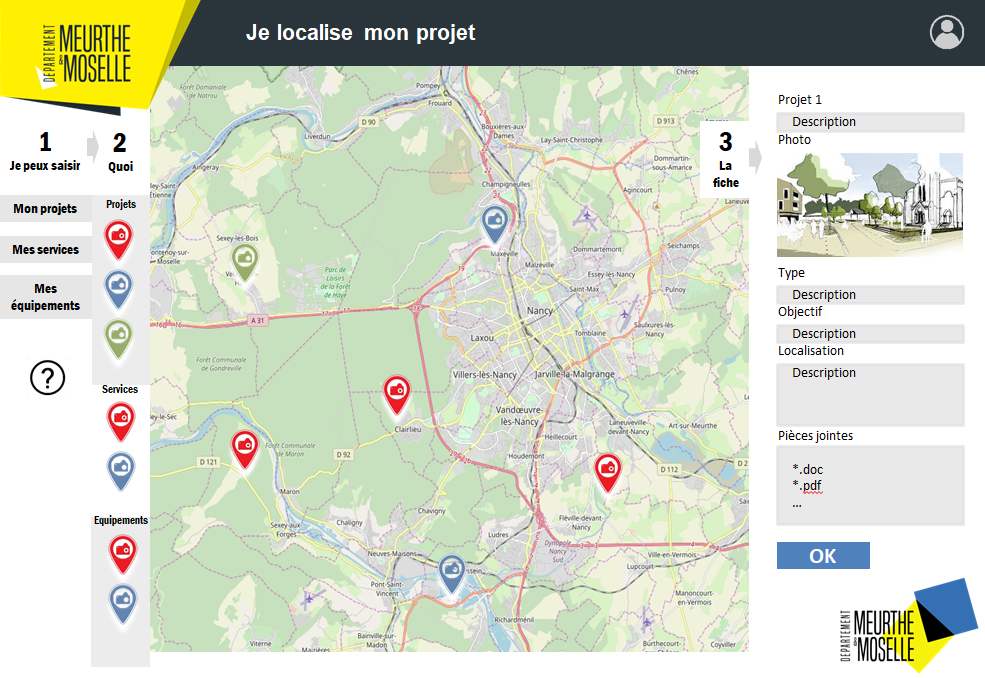

# Application client

## Introduction

Le développement de l'application client représente la majeure partie du travail effectué sur ce projet.

::: tip Informations

**Contexte** : De plus en plus de Services Départementaux et de collectivités ont recours à des outils ou des logiciels SIG, l'idée est de développer un moyen permettant de leur fournir des applications Web rapidement.

**Problème** : Les applications Web de cartographie proposées par le Conseil Département peuvent s'avéer difficiles à prendre en main pour des utilisateurs novices.

**Objectif** : Développer une interface utilisateur simple d'utilisation, permettant de manipuler des géodonnées exposées par un fournisseur de flux WMS/WFS.

**Technologies utilisées** : JavaScript, Vue.js, Leaflet, axios.

:::

## Analyse

La phase d'analyse fut essentielle pour assurer la bonne conduite de ce projet.

En effet, grâce à liste des besoins émise par les différents services demandeurs de ce genre d'outils, nous avons été en mesure d'imaginer à quoi devait ressembler le produit fini.

Cette vision nous a ensuite permis d'énumérer les fonctionnalités à implémenter et donc de définir l'environnement technologique de l'application.

### Besoin

L'objectif est de proposer une application de cartographie accessible à des utilisateurs novices, permettant à ces derniers de saisir des données.

Le terme accessible est très important puisqu'il détermine la direction que doit prendre le projet du point de vue du support et de l'expérience utilisateur.



### Support

De nos jours, le Web permet de créer des applications accessibles rapidement et facilement pour des utilisateurs novices puisqu'ils n'ont besoin que d'un appareil connecté à internet.

Une application Web semble donc être le support adapté pour répondre au besoin.

### Expérience utilisateur

En terme d'expérience utilisateur, il est indispensable que cette dernière soit le plus simple possible. Pour cela, les actions de l'utilisateurs doivent être intuitives et peu nombreuses.

L'objectif de l'application étant de localiser des projets d'aménagement et de fournir des informations à leur propos, il faut que la prise en main du mécanisme de localisation soit intuitive et rapide, et que la saisie des données se fasse via un formulaire simple.

### Fonctionnalités

L'analyse du besoin et de l'expérience utilisateur a servi à établir un liste de fonctionnalités minimales et indispensables permettant de proposer une première version d'application utilisable :

* **Affichage des données** : représenter les données en fonction de leur nature (point, ligne ou polygone) sur une carte dynamique.

* **Ajout, Modification, Suppression** : implémenter les opérations indispensables à la saisie des données.

* **Saisie** : proposer une interface permettant de saisir des données.

* **Persistence** : établir la communication entre l'application client et le serveur afin de persister les données saisies.

## Solution proposée

Voici une démonstration permettant de visualiser l'état d'avancement du projet :


::: warning Note

Cette démonstration présente une version en cours de développement.

:::

Cette section présente la majeure partie du travail qui a été effecuté sur ce projet, puisque la totalité de l'application a été développé à partir de zéro.

Pour commencer, je présenterai l'interface utilisateur et son fonctionnement.

Ensuite, je listerai les **principales technologies** auxquelles j'ai pu avoir recours, en justifiant leur intêret dans ce projet.

Enfin, je reviendrai en détail sur le **développement** de l'application, en illustrant les explications à l'aide **d'extraits de code.**

### Interface utilisateur

Elle peut être découpée en 4 éléments :

* **En-tête** : l'élément sur lequel peut-être affiché le logo de l'application et sur lequel on peut insérer des boutons permettant d'afficher des modals.

* **Carte** : l'élément principal de l'application sur lequel sont représentées les données.

* **Menu** : présentant la **Liste des couches** qui permet de visualiser celles qui sont disponibles, cet élément intègre également une **Légende** associée à chaque couche.

* **Formulaire** : c'est l'élément qui offre à l'utilisateur la possibilité de saisir des données.

**Schéma** :

<Schema></Schema>

::: warning Note

Les éléments **Légende** et **Formulaire** sont rétractables et ne sont pas affichés au lancement de l'application.

:::

Développés **indépendamment** les uns des autres, les éléments de l'interface sont toutefois en mesure de manipuler des **données communes** grâce au module **Vuex** (cf. la section [#Vue.js](/cartogis54/client.html#vue-js)).

Pour faire simple, Vuex crée un **store** permettant de stocker des données qui seront accessibles **partout** dans l'application.

Cet aspect rend l'explication du fonctionnement plus simple :

Au démarrage, les données utiles (couches, entités) sont **récupérées**, **stockées** dans le store et **représentées** sur la carte.

L'utilisateur peut alors **consulter**, **modifier** ou **supprimer** des données existantes ou bien en **créer** de nouvelles.

Lorsque il est satisfait du résultat, l'utilisateur peut fermer la fenêtre de son navigateur puisque tous les changement ont été **immédiatement effectués** dans la base de données.


### Environnement technologique

Au niveau technologique, nous avons du choisir entre Lizmap ou un tout nouvel environnement technique.

Après avoir pris le temps d'analyser les avantages et les inconvénients de chaque option, nous avons décidé de ne pas retenir Lizmap pour ce projet.

Malgré les nombreux avantages proposés par cette solution, c'est sa difficulté de personnalisation qui lui a fait défaut (cf. [la présentation de Lizmap](/prerequis/lizmap)).

#### Nouveau départ

En ce qui concerne le nouvel environnement technologique, j'ai eu l'immense opportunité de choisir les technologies avec lesquelles je souhaitais travailler :

* **Vue.js** : construction de l'interface utilisateur.

* **Leaflet** : affichage des données géospatiales sur une carte interactive.

* **axios** : communication avec le serveur Web via des requêtes HTTP.

J'ai décidé de choisir des technologies que je connaissais de part ma formation en Lience Professionnelle ou de part ma veille technologique personnelle, mais que je ne maitrisais pas.

J'ai fait ce choix en étant convaincu que travailler sur un projet tel que celui-ci serait le meilleur moyen de monter en compétences, que ce soit au niveau de ces outils ou plus généralement sur la prise en main de nouvelles technologies.

##### Vue.js


**Vue** est un [framework](https://fr.wikipedia.org/wiki/Framework) JavaScript **open-source** conçu pour constuire des **interfaces utilisateur**, voir la [documentation](https://fr.vuejs.org/v2/guide/index.html).

L'ayant découvert et apprécié au cours de ma formation en Licence Professionnelle, j'ai souhaité l'utiliser dans le cadre de ce projet.

**Vue** m'a permis de développer rapidement les **composants** qui forment les différentes parties de l'interface de l'application. Ces derniers sont définis dans des fichiers dotés de l'extension `.vue`, offrant la possiblité de déterminer la **structure HTML**, le **comportement** et le **style** :

```vue
// Hello.vue
<template>
    <p class="bienvenue">Bonjour {{ nom }} !</p>
</template>

<script>
export default {
    data() {
        return {
            nom: "Vue"
        }
    }
}
</script>

<style scoped>
.bienvenue {
    text-align: center;
    font-size: 2em;
    color: #A2A2A2;
}
</style>
```

<Hello class="code-block"></Hello>

::: warning Note

Afin de comprendre comment fonctionnent les **composants**, n'hésitez pas à consutler la [documentation](https://fr.vuejs.org/v2/guide/index.html#Composer-avec-des-composants).

Par la suite, lorsque de extraits de codes seront présentés, nous ne reviendrons pas sur les principes de bases des **composants**.

:::

L'une des forces de **Vue** et qu'il offre une possiblité de **personnalisation totale.**

Ainsi, de nombreux modules ont été développées pour venir ajouter des fonctionnalités.

C'est le cas de **Vuex**, un module qui permet de gérer l'état (**state**) de nos applications, voir la [documentation](https://vuex.vuejs.org/).

**Vuex** crée un **store**, à partir duquel on peut définir un **état initial** et des méthodes permettant de **changer** cet état. Il est alors possible d'accéder à l'état du **store** et à ses méthodes depuis n'importe quel **composant** ou **fichier** JavaScript.

```js
import Vue from 'vue'
import Vuex from 'vuex'

Vue.use(Vuex)

const store = new Vuex.Store({
  state: {
    count: 0
  },
  mutations: {
    increment (state) {
      state.count++
    }
  }
})
```

Dans notre cas, ce module a grandement facilité la **transmission de données inter-composant** puisque toutes les données liées aux couches et aux entités sont stockées dans le **store.**

::: warning Note

Afin de comprendre comment fonctionne de **Vuex**, n'hésitez pas à consutler la [documentation](https://vuex.vuejs.org/).

Par la suite, lorsque de extraits de codes seront présentés, nous ne reviendrons pas sur les principes de bases de **Vuex**.

:::

##### Leaflet


our ce qui est de l'affichage de la carte et des entités, j'ai choisi d'utiliser **Leaflet**, une librairie JavaScript open-source pour créer des **cartes interactives**, voir la [documentation](https://leafletjs.com/examples/quick-start/).

<Leaflet></Leaflet>

Ce choix s'est fait naturellement puisque **Leaflet** est de loin la meilleure librairie de cartographie **open-source** pour JavaScript, notamment grâce à son API très **complète** et **simple** à prendre en main.

::: warning Note

Afin de comprendre comment fonctionne de **Leaflet**, n'hésitez pas à consutler la [documentation](https://leafletjs.com/).

Par la suite, lorsque de extraits de codes seront présentés, nous ne reviendrons pas sur les principes de bases de **Leaflet**.

:::

##### axios

Puisqu'il est nécessaire de pouvoir communiquer avec les **Web services** par le biais de **requêtes HTTP**, j'ai décidé de me service **d'axios**, un **client HTTP** JavaScript **open-source** basé sur le principe de [Promise](https://developer.mozilla.org/fr/docs/Web/JavaScript/Reference/Objets_globaux/Promise), voir la [documentation](https://github.com/axios/axios).

```js
import axios from 'axios'

axios.get('https://mon.url')
     .then(maData => {
        console.log(maData)
      })
      .catch(erreur => {
        console.log('Oups...' + erreur)
      })
```

Il est vrai que j'aurai pu utiliser [l'API XMLHttpRequest](https://developer.mozilla.org/fr/docs/Web/API/XMLHttpRequest) ou [l'API fetch](https://developer.mozilla.org/en-US/docs/Web/API/WindowOrWorkerGlobalScope/fetch) et créer mes propres fonctions, mais j'ai souhaité gagner du temps sur cette partie étant donné qu'il y avait déjà une charge de travail importante à fournir à d'autres niveaux.

::: warning Note

Afin de comprendre comment fonctionne de **axios**, n'hésitez pas à consutler la [documentation](https://github.com/axios/axios/blob/master/README.md).

Par la suite, lorsque de extraits de codes seront présentés, nous ne reviendrons pas sur les principes de bases de **axios**.

:::

#### xml-js

Cette librairie gère la conversion **XML vers JavaScript** et inversement, voir la [documentation](https://www.npmjs.com/package/xml-js).

```js
import * as convert from 'xml-js'

const xml = `<Name>Hugo</Name>
             <namespace:Age>22</namespace:Age>`
const options = { compact: true }
const js = convert.xml2js(xml, options)
console.log(js)
/*
{ 
  Name: { 
    _text: "Hugo" 
   }, 
   namespace:Age: { 
     _text: 22
   } 
}
*/
```

```js
import * as convert from 'xml-js'

const js = {
    _declaration: {
        _attributes: { version: "1.0", encoding: "utf-8"}
    },
    rappel: {
        _attributes: { importance: "haute" },
        mission: { _text: "Apprendre Vue.js" },
        date: { _text: "Maintenant !" }
    }
}
const options = { compact: true }
const xml = convert.js2xml(js, options)
console.log(xml)
/*  
    <?xml version="1.0" encoding="utf-8"?>
    <rappel importance="haute">
        <mission>Apprendre Vue.js</mission>
        <date>Maintenant !</date>
    </rappel>
*/
```

Elle s'est avérée être un complément indispensable à **axios** puisque dans le cas de requêtes **POST**, les flux WFS n'accèptent que des données au **format XML.**

**xml-js** m'a donc grandement facilité la construction du **corps** de ces requêtes.

::: warning Note

Afin de comprendre comment fonctionne de **xml-js**, n'hésitez pas à consutler la [documentation](https://github.com/nashwaan/xml-js/blob/master/README.md).

Par la suite, lorsque de extraits de codes seront présentés, nous ne reviendrons pas sur les principes de bases de **xml-js**.

:::

#### Autre

J'ai également eu recours à d'autres librairies telles que [Lodash](https://lodash.com/) ou [Proj4js](http://proj4js.org/) pour quelques besoins précis. 

Ce ne sont donc pas des librairies majeures du projet, bien qu'elles jouent un rôle important.

::: warning Note

L'utilisation de technologies **open-source** est très importante puisqu'elle s'inscrit comme un des fondements de la philosophie du service SIG.

:::

### Strucutre

Le répertoire du projet suit la **structure classique** d'une application **Vue** :

```bash
-- CartoGIS54/
  |-- public/
  |-- src/
    |-- API/
    |-- assets/
    |-- components/
    |-- layouts
    |-- config/
    |-- modals/
    |-- models/
    |-- store/
      |-- modules/
    |-- tools/
    |-- App.vue
    |-- README.md
    |-- app.config.json
    |-- main.js
```

* `CartoGIS54` : racine du projet.

* `public` : contient des fichiers statiques tels que `index.html` ou `favicon.ico`.

* `src/API` : des fonctions facilitant les requêtes HTTP vers le serveur de flux WMS/WFS.

* `src/assets` : feuiles de style, images, vidéos et autres ressources.

* `src/components` : le répertoire dans lequel on définit les composants (fichiers `*.vue`).

* `src/modals` : regroupe les fichiers définissant le contenu à insérer dans les modals.

* `src/models` : classes permettant de représenter des entités (Layer ou Feature).

* `src/store` : le répertoire lié à l'utilisation de **Vuex**.

* `src/store/modules` : des modules permettant de scinder le **store** en plusieurs parties.

* `src/tools` : fonctions utiles qui facilitent certains traitements.

* `src/App.vue` : composant principal de l'application.

* `app.config.json` : fichier de configuration de l'application.

* `src/main.js` : point d'entrée de l'application.

### Configuration

Pour rendre l'application générique et capable de s'intégrer dans plusieurs projets, il est nécessaire de fournir un moyen de configurer l'application.

Toute la configuration peut être définie au sein du fichier `src/app.config.json`.

#### Structure du fichier

**`src/app.config.json`**
```json
{
    "server": {
        "host": string,
        "queryParams": object[]
    },
    "header": {
        "brand": string,
        "modals": object[]
    },
    "form": {
        "inputDate": object[],
        "inputNumber": object[],
        "inputRange": object[],
        "inputText": object[],
        "selectBox": object[],
        "textArea": object[]
    },
}
```

* `server`

Cette section est utilisée pour indiquer à l'application où et comment envoyer les requêtes HTTP permettant de récupérer ou modifier les données.

* `header`

Cette secion sert à fournir une URL vers une image pouvant être utilisée comme logo au sein de **l'En-tête** et offre également la possibilité de configurer les modals à y insérer.

* `form`

Cette section permet de personaliser le composant **Formulaire** de l'interface afin de la rendre plus agréable pour l'utilisateur.

::: warning Note

Pour plus d'informations à propos de la configuration de l'application, vous pouvez lire la [documentation](https://github.com/infogeo54/CartoGIS54/blob/master/src/README.md) (Anglais).

:::


## Fonctionnement

Cette séction détaille la manière dont l'application fonctionne et communique avec le serveur de flux WMS/WFS.

### Initialisation

L'initialisation regroupe les phases de **démarrage**, de **récupération des données** et **d'affichage de l'interface.**

En attendant que toutes ses tâches soient réalisées, l'utilisateur peut appercevoir une **animation de chargement** le laissant comprendre que l'application est entrain de charger :

<Loader></Loader>

::: warning Note

La durée moyenne de ce chargement est relativementement courte (maximum 2 secondes), il arrive même parfois que l'utilisateur n'ait pas le temps d'appercevoir l'animation.

:::

#### Démarrage

Cette phase très courte instancie **Vue** au sein de notre application et permet entre autre d'intègrer un **store** créé à l'aide du module **Vuex** :

**`src/main.js`**
```js
import Vue from 'vue'
import App from '@/App'
import store from '@/store'

new Vue({
  store,
  render: h => h(App),
}).$mount('#app')
```

#### Récupération des données

Dès lors que que la phase de démarrage et terminée, le composant principal de l'application appelle une des actions du **store** afin de lancer la phase de **récupération des données** :

**`src/App.vue`**
```vue
<!-- <template></template> --->

<script>
export default {
  /* [...] */
  methods: {
    ...mapActions('layer', ['getLayers']),
  },
  mounted() {
    this.getLayers()
  }
  /* [...] */
}
</script>

<!-- <style></style> --->
```

* `mapActions()` : permet d'intégrer des **actions du store** parmis les **méthodes** d'un composant.

L'action `getLayers()` a pour objectif de récupérer la liste et la structure des couches en faisant appel à une fonctions permettant de communiquer avec le serveur.

Une fois la liste des couches récupérées, `getLayers()` la parcourt fait appel à deux nouvelles fonctions par couches afin de récupérer, pour chacune d'entre elle, les **styles** et la **liste des entités** existantes :

**`src/store/modules/layers.js`**
```js
/* [...] */
actions: {
    /* [...] */
    getLayers: async function ({ commit }) {
        const layerList = await WFS.fetchLayers() // Récupération de la liste des couches
        const descriptionList = await WFS.fetchAllFeatureDescriptions() // Récupération de la structure de chaque couche
        const layers = await Promise.all(
            layerList.map(async layerData => {
                const name = layerData['Name']['_text']
                const description = descriptionList.find(d => d.layer === name)
                const layer = new Layer({properties: layerData, description: description})
                await layer.getStyles() // Récupération des styles
                await layer.getFeatures() // Récupération des entités
                return layer
            })
        )
        commit('setList', layers)
    },
    /* [...] */
}
/* [...] */
```

**`src/API/WFS.js`**
```js
async function fetchLayers() {
    const url = `${baseUrl}&REQUEST=GetCapabilities`
    const res = await axios.get(url)
    return extractLayers(res.data)
}
``` 

**`src/API/WMS.js`**
```js
async function fetchStyles(layer) {
    const url = `${baseUrl}&REQUEST=GetStyles&LAYERS=${layer}`
    const res = await axios.get(url)
    return extractStyles(res.data)
}
```

**`src/API/WFS.js`**
```js
async function fetchFeatures(layer) {
    const url = `${baseUrl}&REQUEST=GetFeature&TYPENAME=${layer}&OUTPUTFORMAT=GEOJSON`
    const res = await axios.get(url)
    return res.data.features.map(f => {
        f.coordinates = reverseCoordinates(f.coordinates)
        return f
    })
}
```

A partir des données des couches récupérées depuis les WebServices, l'action `getLayers` instancie des objets JavaScript représentant une couche afin de rendre les données plus facilement manipulables :


**Structure d'un objet `Layer`**
```json
{
  "properties": {
    "name": string,
    "title": string
  },
  "description": string,
  "features": Layer[],
  "styles": object[]
}
```

* `properties.name` : le nom de la couche tel qu'il est indiqué dans le projet QGIS et dans la base de données.
* `properties.title` : le titre de la couche tel qui sera affiché dans l'interface utilisateur.
* `description` : la définition de la structure de la couche (nom et type des champs).
* `features` : la liste des entités rattachées à la couche.
* `styles` : les différents types d'entités pouvant être créées dans la couche.

Après avoir été instanciés, tous les objets `Layers` sont stockés dans le **store** afin d'être accessibles partout au sein de l'application.

::: warning Note

Toutes les requêtes HTTP sont effectuées en **parallèle** à l'aide de la méthode `Promise.all()`, sans quoi le temps de chargement serait plus long, voir la [documentation](https://developer.mozilla.org/fr/docs/Web/JavaScript/Reference/Objets_globaux/Promise/all).

:::

#### Affichage de l'interface

Après la phase de récupération des données, l'initialisation se termine par l'affichage de **l'interface utilisateur.** 

Les trois composants principaux (cf. [#Interface utilisateur](/cartogis54/application-client.html#interface-utilisateur)) se chargent de récupérer les données depuis le **store** afin de les **transmettre** aux sous-composants, permettant ainsi l'affichage des informations récupérées plus tôt.

### Interactions avec l'utilisateur

Lorsque la phase d'initialisation est achevée et que l'interface est **visible** pour l'utilisateur, ce dernier peut commencer à se **servir** de l'application.

#### Menu

Le **Menu** est un élément ayant une double utilité au sein de l'application puisqu'il **donne des informations** sur les couches du projet et sert de **point d'entrée** pour la **création** de nouvelles entités.

##### Liste de couches

La **Liste des couches** est un composant qui permet de **visualiser les noms des couches** du projet.

Cliquer sur le nom d'une d'entre elles permet de **déployer la légende qui lui est associée**.


##### Légende

La **Légende** est un composant **listant les différents types d'entités** présents au sein d'une couche.

En cliquant sur un élément de la Légende, l'utilisateur entre alors en **mode édition** et peut **créer une nouvelle entité**.

Le double rôle du **Menu** n'a pas été choisi par hasard puisqu'il s'inscrit dans la dynamique de rendre l'interface **simple d'utilisation** en limitant drastiquement le **nombre d'actions** à fournir par l'utilisateur.

#### Création d'entité

L'entrée en **mode édition** par le biais d'un clic sur un élément de la légende déclenche le démarrage de la phase de **Création d'entité**.

En entrant dans cette phase, l'application se charge de **créer une nouvelle entité** et **l'ajoute dans la liste des entités** de la couche correspondante. 

Ici, toutes les entités sont des **objets** JavaScript possédant une structure commune :

**Structure d'un objet `Feature`**
```json
{
  "id": string,
  "parent": Layer,
  "properties": object,
  "representation": object 
}
```

* `id` : l'identifiant unique de l'entité.
* `parent` : l'instance de `Layer` représentant la couche parente de l'entité.
* `properties` : un objet sous forme de **clé-valeur** représentant les données de l'entité.
* `representation` : un objet décrivant la représentation de l'entité telle qu'affichée sur la carte.

::: warning Note

La propritété `représentation` est créée à l'aide de **l'API de Leaflet**.

:::

##### Placement sur la carte

Dès lors que l'application a créé la nouvelle entité, la Légende se rétracte et l'utilisateur peut apercevoir que son **curseur** s'est transformé en **pointeur**, l'invitant à **cliquer sur la carte** de sorte à déterminer les **coordonées** de l'entité.

Dans le cas d'une entité **polygonale**, il suffit de **placer tous les points du périmètre** et de recliquer sur le **premier point** pour terminer le placement de l'entité.

Les coordonées sont récupérées en réutilisant **l'API de Leaflet** qui offre la possibilité d'ajouter des **écouteurs d'évènement** sur les différents éléments que l'on peut créer (carte, marqueur, polygone, ligne, ...).

Ici, il a suffit d'indiquer à l'application que lorsque nous sommes en phase de **Création d'entité**, il faut écouter les clics sur la carte afin de récupérer les **coordonées** et les **affecter** à l'entité en cours de création.

##### Représentation de l'entité

Après que l'utilisateur ait placé l'entité sur la carte, l'application se charge d'en placer la **représentation** sur la carte.

S'il s'agit d'une entité polygonale, la réprésentation se **met à jour** à chaque fois que l'utilisateur ajoute un **nouveau point** au périmètre.

##### Remplissage du formulaire

Lorsque l'utilisateur a placé l'entité sur la carte, l'application déploie le composant **Formulaire**.

Ce dernier liste les différentes **propriétés** de l'entité sous la forme de **champs remplissables** par l'utilisateur.

::: warning Note

L'apparence des champs du formulaire peut être configurée dans le fichier `src/app.config.json`, voir la section [#Configuration](/cartogis54/client.html#configuration).

:::

Après avoir rempli le Formulaire, l'utilisateur peut cliquer sur le boutton *Enregistrer* pour **insérer** cette nouvelle entité dans la **base de données**.

Cette insertion est possible par le biais des **Transactions**.

### Transactions

Les **Transactions** sont des **requêtes HTTP** envoyées vers le **flux WFS** dans le but **d'insérer**, **modifier** ou **supprimer une ou des entités**.

Ces requêtes sont envoyées vers le WebService via la méthode **`POST`** et doivent contenir des données au format **XML**, respecant une structure très précise :

```xml
<?xml version="1.0"?>
<wfs:Transaction
   version="2.0.0"
   service="WFS"
   xmlns:topp="http://www.openplans.org/topp"
   xmlns:fes="http://www.opengis.net/fes/2.0"
   xmlns:gml="http://www.opengis.net/gml/3.2"
   xmlns:wfs="http://www.opengis.net/wfs/2.0"
   xmlns:xsi="http://www.w3.org/2001/XMLSchema-instance"
   xsi:schemaLocation="http://www.opengis.net/wfs/2.0
                       http://schemas.opengis.net/wfs/2.0/wfs.xsd
                       http://www.opengis.net/gml/3.2
                       http://schemas.opengis.net/gml/3.2.1/gml.xsd">
   <wfs:Insert>
    <education>
      <the_geom>
        <gml:Point srsName="EPSG:2154">
          <gml:pos srsDimension="2">
            48.682971 6.161681
          </gml:pos>
        </gml:Point>
      </:the_geom>
      <nom>IUT Nancy-Charlemagne</nom>
      <type>enseignement superieur</type>
    </topp:tasmania_roads>
   </wfs:Insert>
</wfs:Transaction>
```

L'exemple ci-dessus présente le corps d'une **Transaction** destinée à **insérer** une entité sur une **couche** `education` ayant pour pour **coordonées** `[48.682971, 6.161681]`, pour **nom** `IUT Nancy-Charlemagne` et pour **type** `enseignement superieur`.

::: warning Note

Ici, les champs `nom` et `type` sont directement liées à la **structure** de la couche tandis que le champ `the_geom` est un **champ universel** permettant de renseigner les **coordonées** d'une entité.

:::

De la même manière et en imaginant que l'entité précédente ait été créé en se voyant attribuer **l'identifiant unique** `education.13425`, voici le corps de la **Transaction** à envoyer pour **supprimer** l'entité :

```xml
<?xml version="1.0" ?>
<wfs:Transaction
   version="2.0.0"
   service="WFS"
   xmlns:fes="http://www.opengis.net/fes/2.0"
   xmlns:wfs="http://www.opengis.net/wfs/2.0"
   xmlns:xsi="http://www.w3.org/2001/XMLSchema-instance"
   xsi:schemaLocation="http://www.opengis.net/wfs/2.0
                       http://schemas.opengis.net/wfs/2.0/wfs.xsd">
   <wfs:Delete typeName="education">
      <fes:Filter>
         <fes:ResourceId rid="education.13425"/>
      </fes:Filter>
   </wfs:Delete>
</wfs:Transaction>
```

Ici on se contente d'indiquer au **flux WFS** que l'on souhaite effectuer une **suppresion** sur la resource possédant **l'identifiant** `education.13425` grâce à la balise **`<Filter/>`**.

::: warning Note

Pour ce qui est de la **mise-à-jour**, le corps de la **Transaction** est une **combinaison de l'insertion et de la suppression** puisqu'il suffit de renseigner **les champs et leurs nouvelles valeurs** puis d'ajouter un **filtre** permettant de cibler une resource particulière.

:::

#### Réponse

Après avoir reçu une **Transaction**, le **flux WFS** envoie systématiquement une **réponse** afin d'indiquer si l'opération est un **succès** ou un **échec**.

Dans le cas d'un succès, la réponse contient **l'identifiant** de l'entité créée, modifiée ou supprimée, tandis qu'en cas d'échec, la réponse indique **ce qui a posé problème**.


### Modification d'entité existante

Pour mettre à jour ou supprimer une entité existante, l'utilisateur doit simplement **cliquer sur la représentation** de cette dernière, déclanchant ainsi le démarrage de la phase de **Modification d'entité** et l'ouverture du **Formulaire**.

#### Mise à jour

Lorsque le **Formulaire** est ouvert, l'utilisateur a la possiblité de **déplacer l'entité** ou d'en **modifier les données**.

##### Déplacement de l'entité

Si l'utilisateur clique sur la carte, l'application se charge de **modifier les coordonnées** de l'entité et de **déplacer sa représentation**.

Dans le cas d'une entité **polygonale**, cliquer à un autre endroit permet de **créer un nouveau polygone**.

##### Modification des données

De la même manière que pour la **Création d'entité**, l'utilisateur peut avoir recours aux champs du formulaire pour **modifier les données** d'une entité.

##### Enregistrement

Lorsque l'utilisateur est **satisfait** de ses modifications, il peut appuyer sur le boutton *Enregistrer* afin d'envoyer une **Transaction** de mise à jour dans le but de **persister** ces changements dans la **base de données**.

#### Suppression

En cliquant sur le bouton *Supprimer*, l'utilisateur déclenche l'envoie d'une **Transaction** de suppression.

## Personnalisation

CartoGIS54 étant un **outil générique**, il est essentiel d'offrir la possibilité de **personnaliser** l'interface afin de coller le plus possible aux besoin des utilisateurs.

### Style

Le fichier `src/assets/style/custom.css` a été prévu pour permettre aux personnes souhaitant développer une application Web à l'aide de CartoGIS54 **d'ajouter ou modifier des règles CSS** et ainsi **changer l'apparence** de l'interface.

::: danger Attention

Dans le cas d'une **modification** de règle, il est nécessaire d'ajouter la directive `!important` après vos règles.

En effet, de par le fonctionnement de **Vue.js**, les règles CSS définies au sein des fichiers `.vue` ont la **priorité** et ne peuvent donc pas être **outrepassées** dans cette directive.

Autrement, il est possible d'aller modifier les règles CSS des composants directement dans les fichiers `.vue` correspondants.

:::

### Logo

Au sein du fichier `src/app.config.json`, il est possible d'ajouter un **lien** vers une **image** qui viendra se placer dans **l'En-tête** de l'interface (cf. [#Configuration](/cartogis54/client.html#configuration)).

### Modales

Des **modales** peuvent être intégrées à l'application depuis le **fichier de configuration** (cf. [#Configuration](/cartogis54/client.html#configuration)).

#### Création

Au sein de la section `header.modals` du **fichier de configuration**, il suffit d'ajouter un **objet** respectant la structure suivante :

```json
{
  "name": string,
  "title": string,
  "icon": string,
  "visible": boolean
}
```
* `name` : le nom permettant d'identifier la modale.
* `title` : le titre affiché sur la partie supérieure de la modale.
* `icon` : l'identifiant d'un icône issu de la bibliothèque d'icône [FontAwesome](http://fontawesome.com).
* `visible` : une option indiquant si la modale doit être visible par défaut. 

#### Contenu

Le **contenu** à insérer dans une modale doit être défini dans un **fichier HTML** portant **le même nom** que la modale, au sein du répertore `src/modals/`.

**Exemple**

Après avoir configuré la modale suivante :

```json
{
  "name": "ma_modale",
  "title": "Ma modale",
  "icon": "fas fa-cat",
  "visible": false
}
```

Je crée le **fichier HTML** correspondant :

**`src/modals/ma_modale.html`**

```html
<h3>Ma super modale</h3>
```

#### Intégration

Au lancement, l'application **analyse le fichier de configuration** et ajoute des boutons permettant d'afficher les modales au sein de **l'En-tête**.

Au clic sur un de ces boutons, l'application se charge d'aller récupérer le **contenu** afin de **créer et afficher** la modale associée.

Les modales présentant l'option `visible` avec la valeur `true` seront **visibles au lancement** de l'application.

## Développement

Cette séction reviendra sur mon **ressenti** vis-à-vis de la conduite de ce projet ainsi que sur les **conditions de travail particulières** dues à la pandémie du **COVID-19**.

### Confinement et télétravail

Le développement de ce projet s'est retrouvé quelques peu **bousculé** par l'apparition du **COVID-19.**

En effet, avec les mesures prises par le **gouvernement**, je me suis retrouvé contraint de devoir travailler depuis la maison pedant près de **2 mois.**

Malheureusement, les premières semaines de confinement se sont transformées en **pause forcée** puisque le **Conseil Départemental** a priorisé, à juste titre, la continuité des **services essentiels.**

De ce fait, je n'ai pas pu avoir accès au VPN de mon lieu de travail avant la **4ème semaine** de confinement. Quand bien même, les conditions de travail n'était pas très adapté et il m'était difficile de poursuivre mon avancée de cette manière.

Afin de pouvoir reprendre mon travail rapidement et sous l'accord de mon maître d'apprentissage, je me suis recréé un **environnement de travail virtuel local** grâce à [Docker](https://docker.com). Ce travail **d'administration** et de **configuration serveur** a pris au total **une semaine.**

Au total, ces **4 semaines** ne se sont pas avérées être un handicap puisque j'ai réussi à rattraper mon retard en gagnant du temps sur des tâches que j'avais imaginé plus longues.

### Evolution du projet

Comme j'ai pu l'aborder dans [l'introduction](/cartogis54/), **CartoGIS54** est l'évolution d'un **projet d'application Web de cartographie** ayant démarré en Janvier 2020.

C'est dans une volonté de **réutiliser l'interface** de cette application dans le cadre d'autres projets que mon maître d'apprentissage et moi-même avons pris la décision de **transformer** cette application en **outil permettant de faciliter le développement d'application Web de cartographie**.

Rendre une application **générique** n'est pas une chose aisée puisqu'il faut la rendre le plus **configurable** possible afin de répondre à une multitude de besoins différents.

### Difficultés rencontrées

Au cours du développement de ce projet, j'ai eu à faire face à des **difficultés** variées.

#### Communication avec les WebServices

La prise en main des **flux WMS/WFS** n'a pas été simple.

La cartographie étant un domaine très **spécialisé**, la **recherche d'informations** a été fastidieuse.

Par exemple, il m'a fallu près d'une semaine pour comprendre la manière de **construire** et **envoyer** des **Transactions** (cf. [#Transactions](/cartogis54/client.html#transactions)).

#### Proxy

Peu après le confinement, le **proxy** de mon lieu de travail a été changé et il s'est avéré être un **très gros frein** pour la poursuite du développement.

La quasi-totalité des **outils de développement** que j'utilse au quotidien (GitHub, npm, ...) sont b**loqués par le proxy** et il m'a donc été impossible de poursuivre le développement de certaines fonctionnalités.

### Etat d'avancement

Au moment où j'écris ce rapport, je viens de terminer mon apprentissage au sein du **service SIG**.

Bien qu'une grande partie des **fonctionnalités principales** ait été implémentée, je n'ai pas été en mesure de parvenir à un résultat **déployable** et **utilisable** par de véritables utilisateur.

#### Fonctionnalités non implémentées

Certains aspects **essentiels** n'ont pas encore été abordé et figurent parmis les **prochaines priorités**.

#### Entités linéaires

**CartoGIS54** ayant vu le jour au pendant le développement d'un projet ne gérant que des entités **ponctuelles** et **polygonales**, je n'ai pas eu le temps de gérer la gestion d'entités **linéaires**.

#### Intégration InfoGeo54

À terme, les applications développée par le **service SIG** à l'aide de **CartoGIS54** seront intégrées à la plateforme en cours de développement : **InfoGeo54**.

#### Gestion des utilisateurs

Puisque cette application est destinée à un **usage externe**, il est nécessaire de mettre en place un **système de gestion des utilisateurs** de façon **individuelle** et **groupée**.

En effet, les données appartenant à un utilisateur ou un groupe d'utilisateur **ne doivent pas être visibles** par quiconque d'autre.

Avec un **système de gestion des utilisateurs**, on assurerait une **sécurisation des données** entre utilisateurs et groupes d'utilisateurs, permettant ainsi à l'interface d'être utilisable par le maire d'une commune ou par une collectivité entière.

Puisque les applications développées à l'aide de **CartoGIS54** sont vouées à être déployées sur **InfoGeo54**, une idée aurait été de réutiliser la gestion des utilisateurs de la plateforme en transmettant les données de l'utilisateur via un système de **session**.

#### Enregistrement de fichiers

Par le biais du **Formulaire**, on souhaiterai rendre possible l'ajout de **fichiers** (images, plans, pdf) à l'ensemble des données d'une entité.

Je n'ai malhereusement trouvé **aucune information** mentionnant la possibilité **d'envoyer des fichiers** par le biais d'une **Transaction**.

Il faudrait dans ce cas mettre en place un **service personnalisé** permettant la **transmission de fichiers**.

## Conclusion

Bien qu'il ne soit **pas terminé**, le projet **CartoGIS54** a été une très bonne expérience puisqu'il s'agit du premier projet d'une **telle envergure** sur lequel j'ai eu l'occasion de travailler.

Sachant que ce projet sera surement **repris** par un autre développeur, j'ai fait mon maximum pour rendre le code **lisible** et **maintenable**.

Ces quelques mois de travail m'ont appris énormément de choses d'un point de vue **technique** et **personnel**.

J'ai pu **approfondir** des connaissances acquises au cours de ma formation à l'IUT mais aussi me **former** dans de nouveaux domaines tels que la **cartographie**.

Ayant eu l'occasion de **présenter** mon travail à des personnes n'ayant aucune ou peu de notions de développement, j'ai pu améliorer ma **communication**.

Excepté pour ce qui est du [#Proxy](/cartogis54/client.html#proxy), aucune des **difficultés** recontrées ne s'est avérée être un frein à mon travail puisque j'ai toujours été en mesure de les **surmonter** par le biais de **recherches** ou en **solicitant mes collègues**.

Je suis très **reconnaissant** auprès de mon maître d'apprentissage pour la **confiance** qu'il m'a témoigné en me laissant une très grande **autonomie**, notamment en me permettant de **choisir** les technologies avec lesquelles je souhaitais travailler.