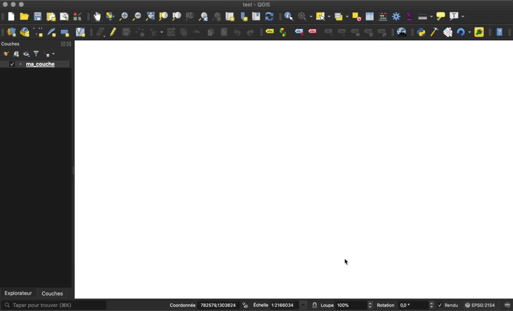

# Plugin QGIS

## Introduction

En parralèle du développment de l'application client, j'ai mis au point un **plugin QGIS** qui en **facilite la configuration**.

::: tip Informations

**Contexte** : Pour rendre CartoGIS54 générique et adaptable à tous les projets, un fichier de configuration a été mis en place.

**Problème** : Remplir le fichier de configuration manuellement peut s'avérer fastidieux.

**Objectif** : Proposer un extension QGIS qui génèrera un fichier de configuration à partir d'informations saisies par l'utilisateur.

**Technologies utilisées** : Python

:::

## Analyse

Cette extension a été pensée pour permettre aux utilisateurs de QGIS d'obtenir une certaine **uniformité** entre leurs **projets** et les **applications Web** qu'ils créent à l'aide de **CartoGIS54**.

En effet, l'idée est de proposer un plugin capable de **convertir la configuration d'un projet QGIS en un fichier de configuration interprétable CartoGIS54**, tout en permettant à l'utilisateur de **saisir des informations** telles que **l'adresse du serveur de flux WMS/WFS**.

Ayant déjà eu l'occasion de développer une extension QGIS au cours de mon apprentissage (cf. [Projets annexes - SMC](/projets-annexes/smc)), j'ai gagné un temps précieux et j'ai pu me concentrer sur **l'analyse des besoins**.

### Besoins

Pour que l'extension soit capable de **générer** un fichier de configuration à partir des **réglages** d'un projet QGIS et d'**informations** saisies par l'utilisateur, il est nécessaire de mettre en places **3 fonctionnalités principales**.

#### Récupérer la configuration des couches

Pour chaque couche, QGIS offre la possibilité de personnaliser le **formulaire d'attributs**.

Ainsi, il est possible de déterminer le **style du champ** (date, nombre, liste de valeurs, ...), une **valeur par défaut** et des **contraintes** telles que l'obligation de remplir le champ.


Nous souhaitons donc récupérer ces informations de sorte à mettre en forme le **Formulaire** de l'application client de la même manière.

#### Permettre la saisie d'informations

L'objectif étant également de permettre à l'utilisateur de saisir des **informations** nécessaires au bon fonctionnement de l'application client, il faut mettre en place une **interface utilisateur**.

#### Générer le fichier de configuration

Enfin, il est nécessaire de l'application soit en mesure de **retranscrire** toutes les informations au sein d'un **fichier**.

L'extension doit également permettre à l'utilisateur de choisir la **destination** de ce fichier.

## Solution proposée

Après quelques jours de développement, je suis parvenu à un résultat répondant aux besoins.




### Fonctionnement

Le fonctionnement de l'extension est assez **simple** puisqu'il n'est composé que de **trois étapes**.

#### 1. Récupération des données

Au lancement, le plugin se charge de **récupérer les données des couches**.

De la même manière que pour le projet [SMC](/projets-annexes/smc), je me sers l'API [PyQGIS](https://qgis.org/pyqgis/3.0/) pour accéder à ces informations.

#### 2. Interface utilisateur

Lorsque les données ont été récupérées, **l'interface apparaît** et l'utilisateur peut commencer à **saisir des informations**.

L'interface est découpée en plusieurs partie, chacune étant liée à une **section** du **fichier de configuration** (cf. [Application Client](/cartogis54/client.html#configuration)).

##### Destination

Sur la partie **supérieure** de l'application, le champ *Destination* permet à l'utilisateur d'indiquer le **chemin** vers le répertoire dans lequel l'extension enregistrera le **fichier de sortie**.


En cliquant sur le boutton à droite de ce champ, l'utilisateur peut utiliser **l'explorateur de fichier** pour sélectionner le répertoire de manière **interactive**.

##### Server

Cette section permet à l'utilisateur de saisir **l'URL** ou **l'adresse IP** du **serveur de flux WMS/WFS** vers lequel l'application client devra effectuer des **requêtes**.


De plus, à l'aide du tableau *Query parameters* il est possible de définir des **paramètres** qui seront ajoutés à chaque requête vers le serveur.

##### Header

Cet onglet est utile si vous souhaitez ajouter un **logo** dans **l'En-tête** de l'interface de votre application client ou bien si vous souhaitez y intégrer des **modales**.


##### Form

Cette dernière section permet de compléter la configuration des champs du **Formulaire** puisqu'elle permet de définir les champs qui doivent être **désactivés** ou **cachés**.


#### 3. Génération du fichier

Au clic sur le bouton *Generate*, le plugin se charge de structurer les données au format **JSON** et de les **écrire** dans un fichier `app.config.json` placé dans le répertoire choisi par l'utilisateur. 

Pour ce faire, on utilise le package `os` de **Python**, permettant de maniupler le **système de fichiers** de la machine :

**`utils/output.py`**

```py
 def save(self):
    parsed_structure = json.dumps(self.structure())
    f = open(self.path(), "w+")
    f.write(parsed_structure)
    f.close()
```

### Structure

La **structure** du projet est presque la même que celle du projet [SMC](/projets-annexes/smc) :

```shell
-- $REPERTOIRE_QGIS_PLUGINS
  |-- CartoGIS54-config/
    |-- utils/
        |-- __init__.py
        |-- form.py
        |-- modals.py
        |-- output.py
        |-- server.py
    |-- __init__.py
    |-- icon.png
    |-- metadata.txt
    |-- pb_tool.cfg
    |-- cartogis54.py
    |-- cartogis54_dialog.py
    |-- cartogis54_dialog_base.ui
    |-- README.md
    |-- resources.py
    |-- resources.qrc
```

* `utils/form.py` : des fonctions permettant de remplir la table de la section Form.
* `utils/modals.py` : des fonctions permettant de remplir la table de la section Header.
* `utils/output.py` : une classe qui structure les données et génère le fichier de sortie.
* `utils/server.py` : des fonctions permettant de remplir la table de la section Server.

::: warning Note

Le contenu des autres fichiers est presque le même que celui de fichiers du projet [SMC](/projets-annexes/smc).

:::

### Développement

Étant donné que ce projet s'est voulu assez **similaire** au projet [SMC](/projets-annexes/smc), le développement s'est déroulé sans **aucune difficulté** puisque j'étais déjà à l'aise avec l'utilisation de l'API [PyQt](https://doc.qt.io/qtforpython/) et de l'API [PyQGIS](https://qgis.org/pyqgis/3.0/), au sein desquelles j'ai pu trouver tous les outils m'ayant permis de parvenir au résultat présenté.

## Conclusion

Bien que **simple**, ce plugin permet de **s'affranchir d'une configuration à la main**.

Travailler sur ce projet aura **renforcé mes compétences** en **Python** et en manipulation d'API de **grande envergure**.