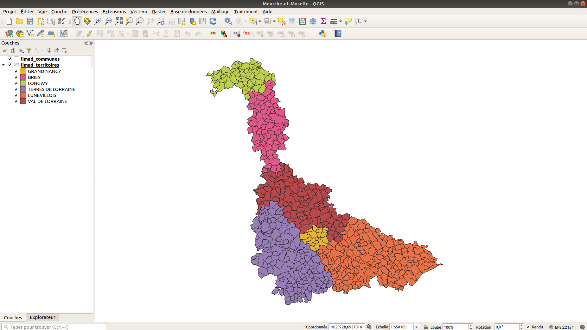
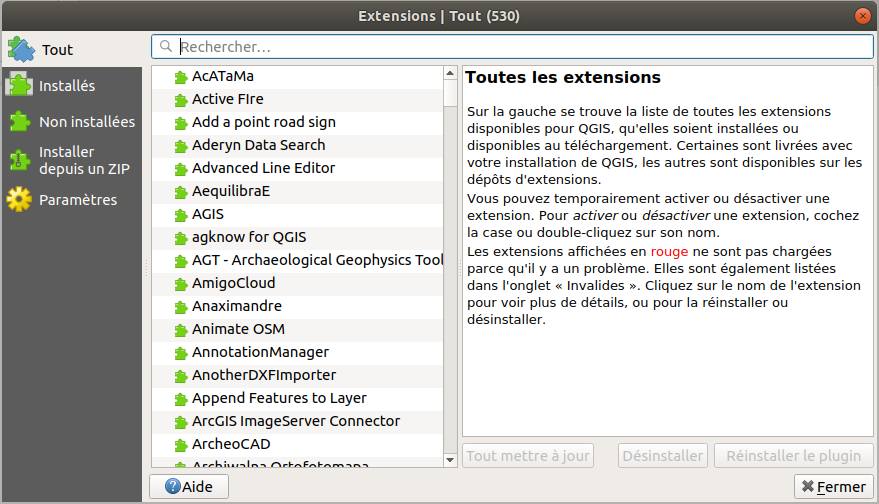

# QGIS

[QGIS](https://qgis.org) est un **logiciel SIG libre, open source et multiplatforme** conçu pour permettre à un utilisateur de manipuler des **données géospatiales**.

Il est notamment intégré à la liste des logiciels libres préconisés par l’État français dans le cadre de la modernisation globale de ses systèmes d’informations.

## Notions

En tant que **logiciel SIG**, son utilisation requiert l'assimilation de **certaines notions** propres à l'univers de la **cartographie**.

La conaissance de ces notions permettra d'aborder sereinement la présentations des projets.

### Canvas

Le **canvas** est l'élément de l'interface utilisateur où sont affichées les **représentations** des données.

### Couches

Dans QGIS (et généralement dans tous les SIG), les données sont organisées sous forme de **couches superposables**.

Une couche possède un **type** qui définit la nature des entités qui la compose. 

Les principaux types sont :

- **Vectoriel** : les données sont réprésentées sous forme **géométrique** (points, lignes, polygones).

- **Raster** : les données raster sont comme des images et peuvent par exemple servir de fond de carte (cf. [documentation](https://docs.qgis.org/3.10/fr/docs/training_manual/rasters/data_manipulation.html)).

Une couche est également caractérisée par des **propriétés** qui seront communes à toutes ses entités.

Ainsi, une couche *Ville* peut être de **type Vectoriel**, posséder une **géométrie polygonale** et les **propriétés** `nom`, `code_postal`, `nb_habitants`, ...

### Entités

Les entités sont les éléments qui **peuplent** une couche.

Une entité **hérite** ses propriétés de la couches à laquelle elle appartient.

### Emprise

Ce terme peut être défini comme le **périmètre englobant tous les éléments visibles**.

Dans QGIS, ce qui définit l'emprise, ce n'est ni plus ni moins que le **canvas**. 

Elle est entièrement **réglable** par l'utilisateur, via la valeur de **l'échelle** ou en **zoomant**.

En prenant exemple sur la photo plus haut, l'emprise est réglée de manière à ce que le département de Meurthe-et-Moselle soit entièrement englobé.

## Plugins

L'aspect **open source** de QGIS le rend **totalement customisable**, notamment en développant des **plugins** qui permettent d'ajouter de **nouvelles fonctionnalités**.

Le logiciel propose notamment une **interface** permettant de **gérer** les extentions installées ou d'en **télécharger** de nouvelles depuis un **dépôt officiel** :

Il arrive que certains plugins développés par la communauté rencontrent un tel succès qu'ils viennent à être **intégrés nativement** dans QGIS.

::: warning Note

**Lizmap** (cf. [présentation de Lizmap](/prerequis/lizmap)) était à l'origine un plugin développé sous la **version 2** de QGIS.

Lors de la release de la **version 3**, il fut inclu dans le logiciel en tant qu'**extension native**.

:::

## Formats des données

La force de QGIS est qu'il permet de travailler avec des données provenant de **sources variées**.

Ainsi, il est possible d'importer des données depuis des **fichiers** (*ShapeFile, GeoPackage, GeoJSON, ..*.) ou de se connecter à une **base de donnée** capable de stocker des **données géospatiales** (cf. [#PostGIS](/prerequis/qgis.html#postgis)).

Il est également possible de **convertir** les données d'un format à l'autre.

## PostGIS

**PostGIS** est le **SGBD** associé par défaut à QGIS.

Il s'agit simplement d'une base de données **PostgreSQL** sur laquelle se greffe une **extension** permettant de stocker des **données géospatiales**.

On peut donc utiliser **PostGIS** pour persister les données des **couches** de nos projets.

Chaque couche sauvegarde la **cofiguration** de la base de données dont elle provient, ce qui permet de **partager** un projet QGIS sans rencontrer de problèmes **d'accès à la source des données**. 

::: warning Note

Cette dernière fonctionnalité permet notamment à **QGIS Server** d'avoir accès aux données [cf. présentation de QGIS Server](/prerequis/qgis-server).

:::
