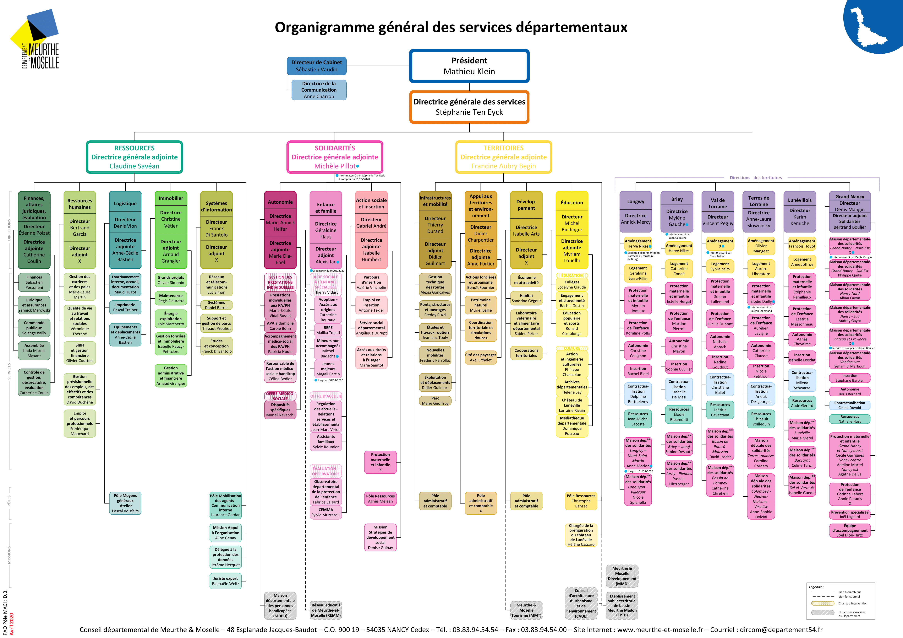

# Présentation

## Introduction

J'ai eu l'opportunité d'effectuer mon année d'étude en **Licence Professionnelle CIASIE** en tant qu'apprenti au sein du **Conseil Départemental de Meurthe-et-Moselle** et plus particulièrement dans le service **Système d'Information Géographique (SIG)**.

Ce compte rendu intermédiaire me permettra de présenter l'institution, le service qui m'a accueilli ainsi que le projet sur lequel je travaille depuis plusieurs mois.

::: tip Informations générales

**Institution** : Conseil Départemental de Meurthe-et-Moselle

**Service** : Système d'Information Géographique

**Apprenti** : Hugo Jahnke

**Maître d'apprentissage** : Hervé Vitoux

**Tuteur académique** : Yann Boniface

:::

## Le Conseil Départemental

Le **Conseil Départemental de Meurthe-et-Moselle** est l'institution administrative qui se place entre les communes du département de **Meurthe-et-Moselle** et la région **Grand-Est**.

Il est composé d'une part d'une **assemblée de représentants élus** (46 conseillers départementaux) et d'autre part de différents **services administratifs** implantés dans les six territoires du département (Maison du département, maison des solidarités, services de routes, ...) et composés de **fonctionnaires territoriaux** (3000 agents, 140 métiers).

Bien que l'action principale soit la **solidarité** avec des problématiques telles que **l'enfance et la famille**, **les personnes âgées**, **handicapées** ou en **difficulté sociale**, le Conseil Départemental possède de nombreuses compétences parmi lesquelles :

* **L'éducation** : Patrimoine des collèges et restauration scolaire.

* **La culture** : médiathèque départementale, Animation socio-éducative et socio-culturelle, restauration d'édifices, conservation des musées et acquisition de collections.

* **L'environnement** : eau, assainissement, gestion de l'espace, protection des espaces naturels sensibles, sentiers de randonnées.

::: warning Note

Certaines compétences sont partagées avec d'autres collectivités locales ou avec l'État.

:::

## Les services départementaux

Pour s'occuper au mieux des différentes thématiques dans lesquelles il est engagé, le Conseil Départemental est divisée en une **multitude de directions**, rattachées à un des **trois grands pôles** :

* **Ressources** : Finances, Ressources humaines, Logistique, Immobilier, Systèmes d'Information.

* **Solidarités** : Autonomie, Enfance et famille, Action sociale et insertion.

* **Territoires** : Infrastructure et mobilité, Appui aux territoires et environnement, Développement, Éducation.

Chaque direction est elle-même divisée en **services départementaux** qui se focalisent sur une **thématique précise**.

## Le service SIG

Au sein du service des **Coopérations territoriales**, le service SIG est directement rattaché à la **Direction du Développement**.

### Composition

Placé sous la responsabilité de **Mme Isabelle Arts**, le service est actuellement composé de 4 personnes :

* **Hervé Vitoux** - *Géomaticien et chef de projet SIG*

* **Ingrid Leblanc** - *Géomaticienne et formatrice SIG*

* **Mohammed Boujjia** - *Géomaticien et administrateur SIG*

* **Hugo Jahnke** - *Apprenti développeur web*

### Objectif

Le service SIG est chargé de mettre à disposition des **outils cartographiques** tels que des **cartes**, des **jeux de données** ou des **applications web** à destination des autres services du Conseil Départemental, des communes du département de Meurthe-et-Moselle ou du grand public.

En effet, la plupart des données sont **mises à disposition librement** et dans plusieurs formats sur [infogeo54.fr](http://catalogue.infogeo54.fr/geonetwork/srv/fre/catalog.search?node=srv#/home).

Les outils mis en place par le service SIG servent **deux intérêts majeurs** :

* **Facilitation de la transmission des données** : grâce aux applications web mis à la disposition des collectivités, la transmission de données vers le Conseil Départemental est facilitée et plus rapide.

* **Aide à la décision** : la visualisation des données géographiques (cartes, applications web) permet au Conseil Départemental d'optimiser la gestion du budget et des subventions.

### Fonctionnement

De la **collecte des données** jusqu'à leur **mise à disposition**, le service SIG intervient à toutes les étapes.

#### Collecte des données

Les géomaticiens du service SIG sont en étroite collaboration avec des **agents de terrain** chargés de récolter des données à travers le département.

Ces données sont variées et liées à **différentes thématiques** telles que le Cadastre, le recyclage des eaux usées ou les voies vertes par exemple.

#### Traitement des données

Lorsque les données ont été récupérées, elles sont prêtes à être utilisées. 

Afin de les manipuler, les géomaticiens du Conseil Départemental utilisent [QGIS](https://qgis.org), un logiel **libre** et **open source** destiné à manipuler des **données géospatiales**.

::: warning Note

Pour en savoir plus sur QGIS et la manière dont il est utilisé au sein du service SIG, consulter la présentation de **QGIS** dans la partie [Prérequis](/prerequis/).

:::

#### Mise à disposition des données

En créant des **cartes**, des **WebServices** ou des **applications web** de cartographie, le service SIG est en mesure de mettre à disposition les données **facilement** et **rapidement**.

Une fois publiées, les données peuvent être récupérées par tout le monde afin d'être réutilisées.

::: warning Note

Pour en savoir plus sur la mise à disposition des données et la création d'application web au sein du service SIG, consulter la présentation de **Lizmap** dans la partie [Prérequis](/prerequis/).

:::

## Mes missions

En intégrant le service SIG en tant qu'apprenti développeur web, j'ai eu la responsabilité d'aider l'équipe sur tout l'aspect informatique.

D'un point de vue technologique, on m'a également chargé d'être **force de proposition** ou de comparer et **tester** différentes **solutions techniques** pour trouver la plus adaptée à une problématique.

Bien que je ne m'y sois pas entièrement cantonné, la majeure partie du temps fût consacrée au **développement** (cf. [Projets](/projets/)).
