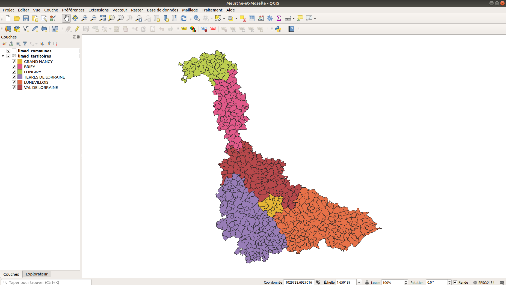

# SMC (Sélection Multi Couches)

::: tip Informations

**Contexte** : Le logiciel QGIS est utilisé par les géomaticiens et les agents de terrain chargés de collecter des données à travers le département de Meurthe-et-Moselle.

**Problème** : N'ayant pas de connexion internet sur le terrain, les agents n'ont donc pas accès aux bases de données. Il sont alors contraints de sauvegader les données sur leur ordinateur portable avant de partir. Cette tâche est fastidieuse puisqu'ils doivent sélectionner manuellement chaque entité qu'ils souhaient sauvegarder en cliquant dessus. Cela devient très pénible pour des gros projets.

**Objectif** : Développer un plugin QGIS permettant la sélection de toutes les entitées présentes dans une emprise définie par l'utilisateur.

**Technologie utilisée** : Python

:::

## QGIS

[QGIS](https://qgis.org) est un logiciel libre et open source destiné à manipuler des données géospatiales.



Son aspect open source le rend totalement customisable, notamment en réutilisant [son API](https://qgis.org/api/) ou en développant des plugins qui permettent d'ajouter de nouvelles fonctionnalités.

::: warning Note

QGIS étant principalement écrit en C++ et Python, il existe donc une [version Python de l'API](https://qgis.org/pyqgis/3.0/)

:::

### Plugins

Les plugins font partie intégrante de l'écosystème QGIS. Le logiciel propose notamment une interface permettant de gérer les extentions installées ou d'en télécharger de nouvelles depuis un dépôt officiel :


Il arrive que certains plugins développés par la communauté rencontrent un tel succès qu'ils viennent à être intégrés nativement dans QGIS.

::: warning Note

**Lizmap** (cf. [Modal](/projets-annexes/modal#lizmap)) était à l'origine un plugin développé sous la version 2 de QGIS. 

Lors de la release de la version 3, il fut inclu dans le logiciel en tant qu'extension native.

:::

## Analyse

Ma mission consistant à développer un plugin, j'ai donc commencé par prendre le temps de lire la [documentation](https://docs.qgis.org/3.10/fr/docs/index.html)

### Intégration d'un plugin

Afin d'intégrer un plugin local, QGIS nous propose de placer notre code dans un répertoire qu'il viendra scanner au démarrage.

```shell
# Exemple de structure de fichiers

-- $QGIS_DIRECTORY
  |-- profiles
    |-- default
      |-- python
        |-- plugins
    |-- mon_profil
      |-- python
        |-- plugins
```

* `profiles` : le répertoire qui stocke les différents profils utilisateurs.

* `profiles/*/python/plugins` : le sous-répertoire dans lequel on peut retrouver le code source des extensions.

::: warning Note

Le répertoire `profiles/default` permet de définir des configurations qui seront appliqués à l'utilisateur par défaut ET à tous les utilisateurs.

Ainsi, dans le répertoire `profiles/default/python/plugins` on pourra retrouver des extensions disponibles pour tous les utilisateurs tandis que le répertoire `profiles/mon_profil/python/plugins` contiendra des extentions uniquement destinées à l'utilisateur *mon_profil*.

:::

### Développement d'un plugin

Pour le développement de plugins, QGIS encourage l'utilisation de Python plutôt que C++.

Ainsi, sur la documentation officielle de QGIS, on peut retrouver le [PyQGIS Developer Cookbook](https://docs.qgis.org/3.10/en/docs/pyqgis_developer_cookbook/index.html) qui explique en profondeur la manière de créer un plugin et d'utiliser [l'API Python](https://qgis.org/pyqgis/3.0/)

#### Structure d'un plugin

```shell
# Exemple de structure de fichiers

-- $QGIS_PLUGINS_DIRECTORY
  |-- mon_super_plugin
    |-- __init__.py
    |-- form.ui
    |-- form.py
    |-- metadata.txt
    |-- mon_super_plugin.py
    |-- resources.py
    |-- resources.qrc
```

* `__init__.py` : le point d'entrée du plugin.

* `form.ui` : l'interface utilisateur que l'on peut éditer avec [Qt Designer](https://doc.qt.io/qt-5/qtdesigner-manual.html).

* `form.py` : la version compilée en Python de `form.ui`.

* `metadata.txt` : les métadonnées relatives au plugin.

* `mon_super_plugin.py` : le code source du plugin.

* `resources.py` : la version compilée en Python de `resources.qrc`

* `resources.qrc` : un fichier au format XML créé par [Qt Designer](https://doc.qt.io/qt-5/qtdesigner-manual.html) et contenant des informations relatives à l'interface utilisateur.

Ces fichiers composent le squelette de base d'un plugin QGIS. 

Pour un plugin d'une plus grande ampleur il est possible de se retrouver avec des architectures telles que celle-ci : 

```shell
# Exemple de structure de fichiers

-- $QGIS_PLUGINS_DIRECTORY
  |-- mon_super_plugin
    |-- help
      |-- build
        |-- html
    |-- make.bat
    |-- Makefile
    |-- source
      |-- conf.py
      |-- index.rst
      |-- _static
      |-- _templates
    |-- i18n
      |-- af.ts
    |-- icon.png
    |-- __init__.py
    |-- Makefile
    |-- metadata.txt
    |-- mon_super_plugin_dialog_base.ui
    |-- mon_super_plugin_dialog.py
    |-- mon_super_plugin.py
    |-- pb_tool.cfg
    |-- plugin_upload.py
    |-- pylintrc
    |-- README.html
    |-- README.txt
    |-- resources.py
    |-- resources.qrc
    |-- scripts
      |-- compile-strings.sh
      |-- run-env-linux.sh
      |-- update-strings.sh
    |-- test
      |-- __init__.py
      |-- qgis_interface.py
      |-- tenbytenraster.asc
      |-- tenbytenraster.asc.aux.xml
      |-- tenbytenraster.keywords
      |-- tenbytenraster.lic
      |-- tenbytenraster.prj
      |-- tenbytenraster.qml
      |-- test_init.py
      |-- test_mon_super_plugin_dialog.py
      |-- test_qgis_environment.py
      |-- test_resources.py
      |-- test_translations.py
      |-- utilities.py
```

Dans notre cas, la premier structure de fichiers devrait suffire puisque le plugin qu'il faut développer ne doit contenir que quelques instructions.
