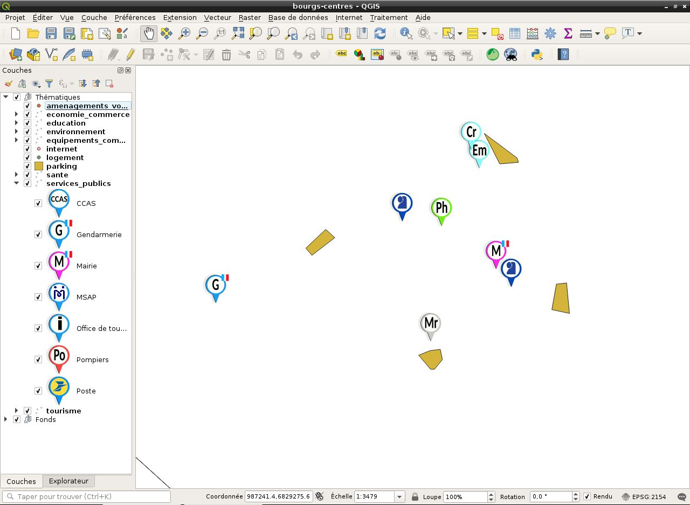

# Bourgs-Centres

## Introduction

**Bourgs-Centres** est le nom provisoire du projet majeur sur lequel j'ai eu l'opportunité de travailler pendant cette année au sein du service SIG.

Sous un format **d'application Web**, c'est un outil qui permettra aux utilisateurs de **saisir des données relatives à des projets d'aménagement.**

::: tip Informations

**Contexte** : Afin de redynamiser certains territoires autour de communes motrices appelées **Bourgs-Centres**,  le Conseil Départemental souhaite proposer un outil cartographique à destination des maires de ces communes.

**Problème** : D'ordinaire développées à l'aide de **Lizmap**, les applications Web de cartographie proposées par le Conseil Départemental peuvent s'avérer difficiles à prendre en main pour des utilisateurs novices.

**Objectif** : Permettre aux utilisateurs de saisir leurs données via une interface simple et intuitive.

**Technologies utilisées** : Vue.js, Leaflet, axios, QGIS, QGIS Server, PostGIS

:::

## Analyse

La phase d'analyse fut essentielle pour assurer la **bonne conduite** de ce projet.

En effet, grâce à **liste des besoins** émise par les différents services impliqués dans le développement des Bourgs-Centres, nous avons été en mesure d'imaginer à quoi devait ressembler le **produit fini.**

Cette vision nous a ensuite permis d'énumérer les **fonctionnalités** à implémenter et donc de définir **l'environnement technologique** de l'application.

### Besoin

L'objectif est de proposer une application de cartographie **accessible** à des utilisateurs novices, permettant à ces derniers de **saisir des données.**

Le terme **accessible** est très important puisqu'il détermine la direction que doit prendre le projet du point de vue du **support** et de **l'expérience utilisateur**.

#### Support

De nos jours, le Web permet de créer des applications **accessibles rapidement et facilement** pour des utilisateurs novices puisqu'ils n'ont besoin que d'un **appareil connecté à internet.** 

Une **application Web** semble donc être le support adapté pour répondre au besoin.

#### Expérience utilisateur

En terme d'expérience utilisateur, il est nécessaire de la rendre le plus simple possible. Pour cela, les actions de l'utilisateurs doivent être **intuitives** et **peu nombreuses.**

L'objectif de l'application étant de **localiser** des projets d'aménagement et de **fournir des informations** à leur propos, il est indispensable que la prise en main du mécanisme de localisation soit **intuitive** et **rapide**, et que la saisie des données se fasse via un **formulaire simple.**

#### Fonctionnalités

L'analyse du besoin et de l'expérience utilisateur a permis d'établir un liste de **fonctionnalités minimales**, nécessaires pour proposer une première version d'application **déployable** et **utilisable** :

* **Affichage des données** : représenter les données en fonction de leur nature (point, ligne ou polygone) sur une carte dynamique.

* **Ajout, Modification, Suppression** : implémenter les opérations indispensables à la saisie des données.

* **Saisie** : proposer une interface permettant de saisir des données.

* **Persistence** : établir la communication entre l'application client et le serveur afin de persister les données saisies.

### Technologies

Afin de rester **cohérent** avec l'environnement technique le fonctionnement du service SIG, la **partie serveur** sera développé à l'aide des technologies habituelles :

* **QGIS** : création et configuration du projet.

* **QGIS Server** : génération et publication des flux WMS/WFS.

* **PostGIS** : persitence des données.

Pour en savoir plus sur ces technologies, voir les [prérequis](/prerequis/).

Au niveau de la **partie client**, nous avons du choisir entre **Lizmap** ou partir sur un tout nouvel environnement technique.

Après avoir pris le temps d'analyser les avantages et les inconvénients de chaque option, nous avons décidé de ne pas retenir **Lizmap** pour ce projet. 

En effet, malgré les nombreux avantages proposés par cette solution, c'est sa **difficulté de personnalisation** qui lui a fait défaut (cf. la [présentation de Lizmap](/prerequis/lizmap.html#inconvenient)).

#### Nouveau départ

En choisissant de ne pas utiliser **Lizmap**, il était nécessaire de définir un **nouvel environnement technique** nous permettant d'implémenter toutes les **fonctionnalités minimales** :

* **Vue.js** : un framework JavaScript open-source conçu pour constuire des **interfaces utilisateur**, voir la [documentation](https://fr.vuejs.org/).

* **Leaflet** : une librairie JavaScript open-source pour créer des **cartes interactives**, voir la [documentation](https://leafletjs.com/).

* **axios** : un **client HTTP** JavaScript open-source basé sur le principe de [Promise](https://developer.mozilla.org/fr/docs/Web/JavaScript/Reference/Objets_globaux/Promise), voir la [documentation](https://github.com/axios/axios).

Vous pouvez retrouver la justification du choix de ces technologies dans la section [#Côté client](/projets/bourgs-centres.html#cote-client).

::: warning Note

L'utilisation de technologies **open-source** est très importante puisqu'elle s'inscrit comme un des fondements de la philosophie du service SIG.

:::

## Solution proposée

Voici une démonstration permettant de visualiser l'état d'avancement du projet :

::: warning Note

Cette démonstration présente une version en cours de développement.

La priorité étant d'implémenter les fonctionnalités minimales, il n'y a donc pas encore eu de réel travail au niveau de l'interface utilisateur.

:::

### Interface

Elle peut être découpée en 3 éléments :

* **Carte** : l'élément principal de l'application sur lequel sont représentées les données.

* **Menu** : présentant la **Liste des couches** qui permet de visualiser celles qui sont disponibles, cet élément intègre également une **Légende** associée à chaque couche.

* **Formulaire** : c'est l'élément qui offre à l'utilisateur la possibilité de saisir des données.

### Fonctionnement

Développés indépendamment les uns des autres, les éléments de l'interface sont toutefois en mesure de manipuler des données communes grâce au module **Vuex** (cf. la section [#Vue.js](/projets/bourgs-centres.html#vue-js)).

Pour faire simple, Vuex crée un **store** permettant de stocker des données qui seront accessibles partout dans l'application.

Cet aspect rend l'explication du fonctionnement plus simple :

Au démarrage, les données utiles (couches, entités) sont récupérées, stockées dans le store et représentées sur la carte.

L'utilisateur peut alors consulter, modifier ou supprimer des données existantes ou bien en créer de nouvelles.

Lorsque il est satisfait du résultat, l'utilisateur peut fermer la fenêtre de son navigateur puisque tous les changement ont été immédiatement effectués dans la base de données.

Ce fonctionnement permet à l'utilisateur de ne se soucier que de la consultation ou la mise à jour de ses données.

## Côté serveur

Avant d'entreprendre le développement de l'application client, il fut nécessaire de mettre en place la **partie serveur**, reponsable de la **gestion des données.**

::: warning Note

La totalité du travail présenté ici a été réalisée sur un **serveur de test.** 

Il n'y avait donc pas de vértiable risque, ce qui m'a permis de configurer toute la partie serveur moi-même.

:::

### Administration serveur

Avant toute chose, j'ai commencé par configurer **l'environnement technique** du serveur de test :

* **Mise à jour des outils** : installation des dernières versions de **QGIS**, **QGIS Server** et **PostGIS.**

* **Configuration du serveur Web** : création d'un **VirtualHost Apache** et configuration de QGIS Server (cf. la [présentation de QGIS Server](/prerequis/qgis-server)).

* **Administration de la base de données** : création du **schéma** et des différentes **tables**.

### Configuration du projet QGIS

L'environnement mis en place, j'ai pu créer le **projet QGIS** à partir duquel QGIS Server génèrera les **Web services.**

#### Couches

On distingue deux groupes de couches au sein du projet :

* **Fonds** : dans notre cas on ne retrouve que la couche *limad_communes*, affichant les **limites administratives** des communes de Meurthe-et-Moselle, mais on pourrait y retrouver des **fonds de carte** ou des **photos aériennes.**

* **Catégories** : les différentes **thématiques** pouvant être abordées par les **Bourgs-Centres**, telles que l'Éducation, la Santé ou le Tourisme.

Les couches au sein du groupe **Catégories** sont toutes des couches de **type vectoriel** puisque la totalité des entités du projet Bourgs-Centres seront représentées par des **formes géométriques** (cf. la [présentation de QGIS](/prerequis/qgis.html#notions)).

#### Styles

Sur la capture d'écran au-dessus, on peut distinguer que chaque couche possède sa propre liste de **marqueurs**, qu'elle attribue à ses entités en fonction de la **valeur** contenue dans leur champ *type*.

Par exemple, dans le cas de la couche Éducation, les valeurs du champ *type* peuvent être :  `collège`, `crèche`, `école maternelle`, `école primaire` ou `lycée`.

Chaque entité se verra donc attribuer le marqueur correspondant à la valeur contenue dans ce champ (cf. la [présentation de QGIS](/prerequis/qgis.html#notions)).

#### Publication des flux WMS/WFS

Afin que QGIS Server puisse être en mesure de générer des **Web services** depuis le projet QGIS, il est nécessaire d'y ajouter quelques **configurations** :

* **Capacités des services** : ensemble de **métadonnées** qui seront publiées dans la réponse des requêtes *GetCapabilities*.

* **Capacités WMS** : réglage de **l'emprise** contenant les données à publier et du **système de coordonées** (SCR), **exclusion** de certaines couches (ici celles du groupe **Fonds**).

* **Capacités WFS** : sélection des couches qui verront les données de leurs entités **publiées** et des **opérations** pouvant êtres réalisées sur ces dernières (Insertion, Mise à jour, Suppression).

Lorsque la configuration est terminée, il suffit d'enregister les modifications apportées au projet QGIS.

Les données sont alors **immédiatement disponibles** via les flux WMS et WFS (cf. la [présentation de QGIS Server](/prerequis/qgis-server.html#flux-wms-wfs)).

## Côté client

persistence instantanée (possible de modifier un élément tout juste inséré sans refresh)

### Choix des technologies

Liberté

#### Vue.js

**vuex**

#### Leaflet

#### axios

### Développement

## Confinement et télétravail

Pause forcée (VPN) = 3 semaines, Docker (recommencer le travail d'admin avant de reprendre le dev) = 1 semaine, au total 4 semaines de stand-by pour le dev

## À venir

Gestion des utilisateurs

## Conclusion intermédiaire
