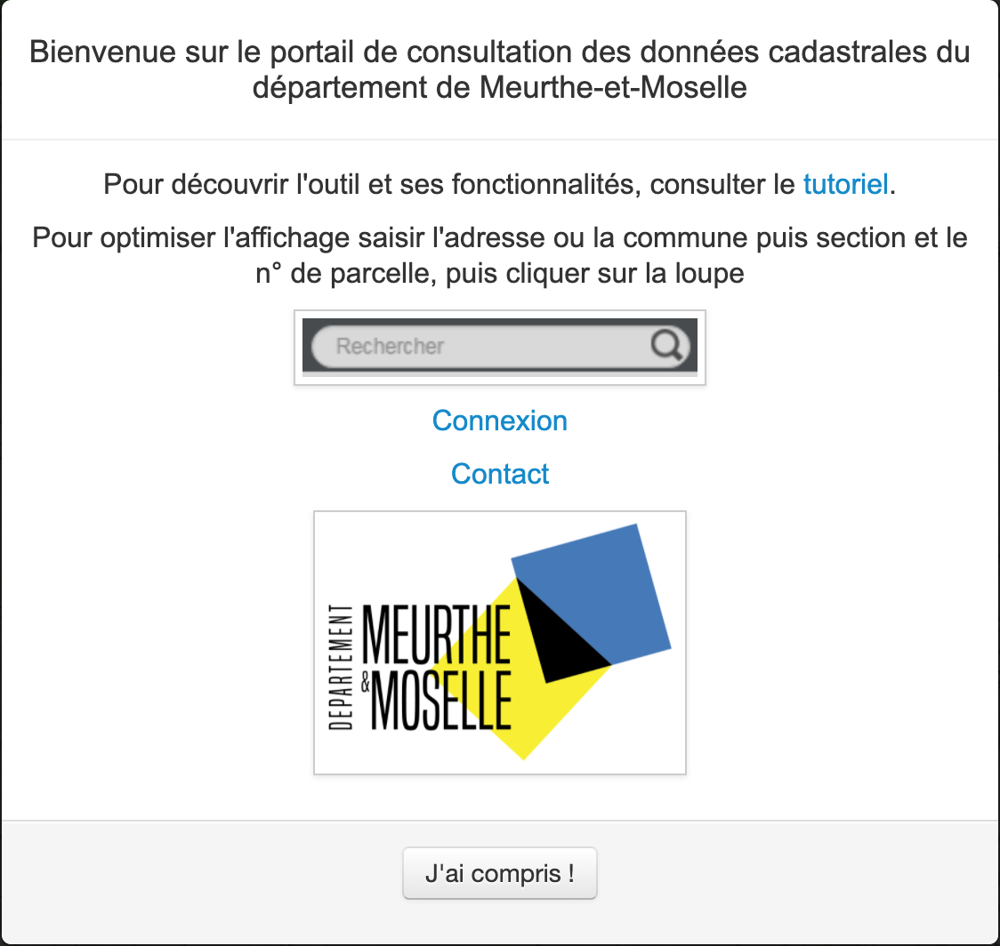
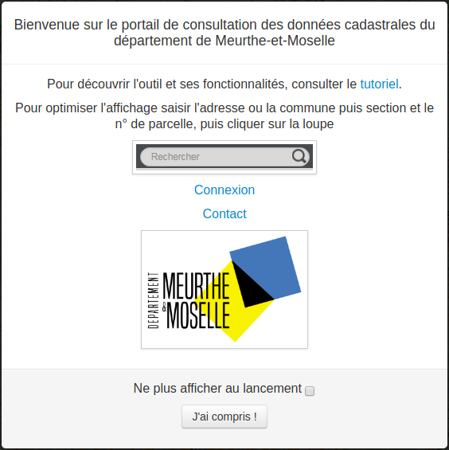

# Modal

## Introduction

Ce premier projet m'a permis de prendre en main et customiser une application **Lizmap** afin de permettre à l'utilisateur de gérer le comportement d'une modal d'aide s'affichant au lancement de l'application.

::: tip Informations

**Contexte** : Les applications Web proposées par le service SIG sont souvent destinées à des utilisateurs novices. Pour les aider, une modal explicative apparaît au lancement des applications.

**Poblème** : Cette modal appraît à chaque lancement d'application sans qu'il n'y est aucun moyen de l'en empêcher.

**Objectif** : Revoir le code de la modal et ajouter un moyen permettant à l'utilisateur d'empêcher son apparition lors des utilisations futures.

**Technologie utilisée** : JavaScript

:::



## Analyse

### Code

Après avoir consulté les fichiers liés à la modal, j'ai remarqué que je pouvais apporter quelques modifications :

- **Mise à jour** : le code était écrit selon les anciens standards d'[ECMAScript](https://developer.mozilla.org/fr/docs/Web/JavaScript/Language_Resources), j'ai donc utilisé des fonctionnalités plus récentes afin d'améliorer la qualité du code (let/const au lieu de var, utilisation des backquotes, ...).

- **Bootstrap** : le framework étant directement intégré à Lizmap, il n'était pas nécessaire de créer un fichier CSS pour apporter du style à la modal.

- **jQuery**: la librairie étant directement intégrée à Lizmap, il est possible de l'utiliser afin de simplier le code.

### Bloquer l'affichage de la modal

Afin d'empêcher la modal de s'afficher lorsque l'utilisateur le décide, il était nécessaire de mettre en place deux choses :

- **Interaction** : créer un moyen permettant à l'utilisateur de désactiver l'affichage de la modal au lancement de l'application.

- **Sauvegarde du choix** : le choix de l'utilisateur doit être stocké quelque part afin d'être consultée au lancement de l'application.

#### Interaction

Afin de permettre à l'utilisateur de choisir s'il souhaite voir apparaître la modal au lancement de l'application, le moyen le plus simple est d'intégrer une checkbox :

```html
<input type="checkbox">
```

#### Sauvegarde du choix

Une fois que l'utilisateur était en mesure de choisir s'il voulait masquer la modal lors de ses futures utilisations, il fallait mettre en place un moyen permettant de sauvegarder son choix.

Plusieurs moyens étaient alors envisageables :

* **Modifier le code source** : en apportant des modifications au code source de Lizmap et en ajoutant un champ dans la table des utilisateurs au sein de la base de données.

* **Sauvegarder dans le navigateur** : en utilisant la [Web Storage API](https://developer.mozilla.org/fr/docs/Web/API/Web_Storage_API), il est possible de sauvegarder des données dans le navigateur.

## Solution proposée

En gardant le contenu, la disposition et le style d'origine de la modal, j'ai revu son intégration au sein de l'application.



::: warning Note

Tout le code qui suit est écrit au sein d'un seul et même fichier JavaScript, placé dans le répertoire adequat du projet **Lizmap** (cf. la [présentation de Lizmap](/prerequis/lizmap.html#modifications)).

:::

### Structure

La structure de la modal est définie dans une seule variable à l'aide des backquotes :

```js
const modalContent =
    `<div class="modal-dialog" role="document">
       <div class="modal-content">
          <div class="modal-header">
            <h4 class="modal-title">
                Bienvenue sur le portail de consultation des données cadastrales du département de Meurthe-et-Moselle
            </h4>
          </div>
          <div class="modal-body">
            <p align="center">
              Pour découvrir l'outil et ses fonctionnalités, consulter le <a href="http://infogeo54.fr/fichiers/aide_lizmap_cadastre.pdf" target="_blank">tutoriel</a>.
            </p>
            <p align="center">
              Pour optimiser l'affichage saisir l'adresse ou la commune puis section et le n° de parcelle, puis cliquer sur la loupe
            </p>
            <p align="center">
              
            </p>
            <p align="center">
              <a href="http://infogeo.meurthe-et-moselle.fr/admin.php/auth/login/?auth_url_return">Connexion</a>
            </p>
            <p align="center">
              <a href="mailto:infogeo54@departement54.fr?subject=Demande d'informations sur le portail de consultation des données cadastrales infogeo54.fr&">Contact</a>
            </p>
            <div>
              <p align="center">
                
             </p>
            </div>
          </div>
          <div class="modal-footer">
            <div>
              <p class="text-muted" align="center">
                Ne plus afficher au lancement <input id="checkbox-disable" class="form-control" type="checkbox">
              </p>
            </div>
            <p align="center">
              <button type="button" id="btn-validate" data-dismiss="modal" class="btn btn-default">J'ai compris !</button>
            </p>
          </div>
       </div>
     </div>`
```

### Intégration

La modal est intégrée à l'arborescence puis masquée :

```js
const modal = $("div#lizmap-modal")
    .html(modalContent)
    .modal('hide')
```

::: warning Note

La méthode `modal()` est issue de la librairie JavaScript de Bootstrap, voir la [documentation](https://getbootstrap.com/docs/4.5/components/modal/#methods).

:::

### Affichage de la modal

Par soucis de complexité et de sécurité, la meilleure option était de recourir à la [Web Storage API](https://developer.mozilla.org/fr/docs/Web/API/Web_Storage_API), présente dans la quasi-totalité des navigateurs modernes, voir [Can I use](https://caniuse.com/#feat=namevalue-storage).

::: tip Fonctionnement du Web Storage

Les deux mécanismes au sein du web storage sont les suivantes :

- `sessionStorage` maintient une zone de stockage distinct pour chaque origine donnée qui est disponible pour la durée de la session de la page (tant que le navigateur est ouvert, y compris les rechargements et restaure)
- `localStorage` fait la même chose, mais persiste même lorsque le navigateur est fermé et rouvert.

*source : [MDN](https://developer.mozilla.org/fr/docs/Web/API/Web_Storage_API)*

:::

Dans notre cas, le module le plus adapté est évidemment `localStorage` puisque l'on souhaite sauvegarder une information pour "toujours".

#### Fonctionnement

Au lancement de l'application, on vérifie dans le `localStorage` si une information concernant l'affichage de la modal est présente. Si ce n'est pas le cas, on affiche la modal :

```js
function displayModal() {
    const userChoice = localStorage.getItem('displayModal')
    if (!userChoice){
        modal.modal('show')
    }
}
```

Ainsi, il suffit de stocker un ensemble clé/valeur dans le `localStorage` lorsque l'utilisateur décide de ne plus afficher la modal :

```js
function disableModal() {
    localStorage.setItem('displayModal', 'false')
}
```

::: warning Note

Bien que dans notre cas, la valeur à stocker soit un booléen, le `localStorage` permet seulement de stocker des données au format **chaîne de caractères**. 

C'est ce qui justifie que la valeur stockée soit `'false'` et non `false`.

:::

Lorsque ces deux fonctions ont été définies, il ne reste plus qu'à ajouter un `event listener` sur le bouton *J'ai compris* de la modal. 

Si la checkbox est cochée lorsque ce boutton est pressé, la fonction `disableModal` est appelée afin de sauvegarder le choix de l'utilisateur :

```js
$("#btn-validate").on('click', function () {
    const checkbox = $('#checkbox-disable')
    if (checkbox.is(':checked')) {
        disableModal()
    }
})
```

## Conclusion

Après avoir pris le temps d'analyser le problème et de réfléchir à différentes approches, je suis parvenu à trouver une solution simple.

L'avantage étant que la solution proposée rend la fonctionnalité facilement maintenable.

En effet, si on avait choisi de modifier le code source de Lizmap ou la structure de la base de données, on aurait pu s'exposer à des problèmes bien plus difficile à corriger.

Ce premier projet fut une très bonne entrée en matière car il m'a permis de découvrir mon environnement de travail et de monter en compétences sur deux points :

* **Utilisation d'outils existants** : la bonne lecture des documentations m'a permis de réutiliser des outils existants, ici le `localStorage`, et de ne pas "réinventer la roue".

* **Rejoindre un projet en cours** : en travaillant sur un projet existant, j'ai pu me rendre compte des capacités requises pour rejoindre un projet en cours, notament la prise en main des outils et manières de travailler de l'équipe.
