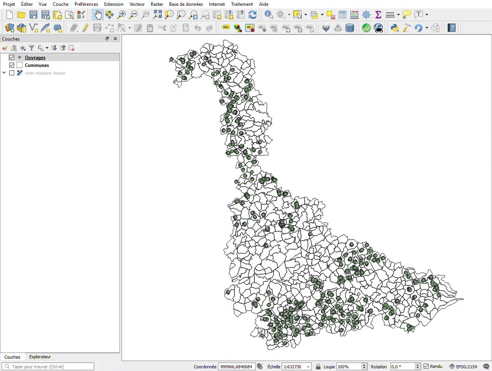

# SMC (Sélection Multi Couches)

## Introduction

J'ai été chargé de créer un plugin pour **QGIS** permettant de sélectionner instantanément toutes les entités visibles dans l'interface.

::: tip Informations

**Contexte** : Le logiciel QGIS est utilisé par les géomaticiens et les agents de terrain chargés de collecter des données à travers le département de Meurthe-et-Moselle.

**Problème** : N'ayant pas de connexion internet sur le terrain, les agents n'ont donc pas accès aux bases de données. Il sont alors contraints de sauvegader les données sur leur ordinateur portable avant de partir. Cette tâche est fastidieuse puisqu'ils doivent sélectionner manuellement chaque entité qu'ils souhaient sauvegarder en cliquant dessus. Cela devient très pénible pour des projets de grande envergure.

**Objectif** : Développer un plugin QGIS permettant la sélection de toutes les entités présentes dans l'emprise définie par l'utilisateur.

**Technologie utilisée** : Python

:::

## Analyse

Ma mission consistant à **développer un plugin**, j'ai donc commencé par prendre le temps de **chercher des informations** et de lire la [documentation](https://docs.qgis.org/3.10/fr/docs/index.html) avant **d'analyser le besoin**.

### Intégration d'un plugin

Afin d'intégrer un plugin local, QGIS nous propose de placer notre code dans un répertoire qu'il viendra scanner au démarrage :

```shell
# Exemple de structure de fichiers

-- $REPERTOIRE_QGIS
  |-- profiles
    |-- default
      |-- python
        |-- plugins
    |-- mon_profil
      |-- python
        |-- plugins
```

* `profiles` : le répertoire qui stocke les différents profils utilisateurs.

* `profiles/*/python/plugins` : le sous-répertoire scanné par QGIS, dans lequel on peut retrouver le code source des extensions.

::: warning Note

Le répertoire `profiles/default` permet de définir des configurations qui seront appliqués à l'utilisateur par défaut **ET** à tous les utilisateurs.

Ainsi, dans le répertoire `profiles/default/python/plugins` on pourra retrouver des extensions disponibles pour tous les utilisateurs tandis que le répertoire `profiles/mon_profil/python/plugins` contiendra des extentions destinées à l'utilisateur *mon_profil* **uniquement**.

:::

### Développement d'un plugin

Pour le développement de plugins, QGIS encourage l'utilisation de **Python** plutôt que C++.

Ainsi, sur la documentation officielle de QGIS, on peut retrouver le [PyQGIS Developer Cookbook](https://docs.qgis.org/3.10/en/docs/pyqgis_developer_cookbook/index.html) qui explique de manière détaillée la marche à suivre pour créer un plugin en utilisant [l'API Python](https://qgis.org/pyqgis/3.0/).

#### Structure d'un plugin

```shell
# Structure minimale

-- $REPERTOIRE_QGIS_PLUGINS
  |-- mon_super_plugin
    |-- __init__.py
    |-- form.ui
    |-- form.py
    |-- metadata.txt
    |-- mon_super_plugin.py
    |-- resources.py
    |-- resources.qrc
```

* `__init__.py` : le point d'entrée du plugin.

* `form.ui` : l'interface utilisateur que l'on peut éditer avec [Qt Designer](https://doc.qt.io/qt-5/qtdesigner-manual.html).

* `form.py` : la version compilée en Python de `form.ui`.

* `metadata.txt` : les métadonnées relatives au plugin.

* `mon_super_plugin.py` : le code source du plugin.

* `resources.py` : la version compilée en Python de `resources.qrc`

* `resources.qrc` : un fichier au format XML créé par [Qt Designer](https://doc.qt.io/qt-5/qtdesigner-manual.html) et contenant des informations relatives à l'interface utilisateur.

Ces fichiers composent le **squelette de base** d'un plugin QGIS.

Pour un plugin d'une **plus grande ampleur** il est possible de se retrouver avec des architectures telles que celle-ci : 

```shell
# Structure complexe

-- $REPERTOIRE_QGIS_PLUGINS
  |-- mon_super_plugin
    |-- help
      |-- build
        |-- html
    |-- make.bat
    |-- Makefile
    |-- source
      |-- conf.py
      |-- index.rst
      |-- _static
      |-- _templates
    |-- i18n
      |-- af.ts
    |-- icon.png
    |-- __init__.py
    |-- Makefile
    |-- metadata.txt
    |-- mon_super_plugin_dialog_base.ui
    |-- mon_super_plugin_dialog.py
    |-- mon_super_plugin.py
    |-- pb_tool.cfg
    |-- plugin_upload.py
    |-- pylintrc
    |-- README.html
    |-- README.txt
    |-- resources.py
    |-- resources.qrc
    |-- scripts
      |-- compile-strings.sh
      |-- run-env-linux.sh
      |-- update-strings.sh
    |-- test
      |-- __init__.py
      |-- qgis_interface.py
      |-- tenbytenraster.asc
      |-- tenbytenraster.asc.aux.xml
      |-- tenbytenraster.keywords
      |-- tenbytenraster.lic
      |-- tenbytenraster.prj
      |-- tenbytenraster.qml
      |-- test_init.py
      |-- test_mon_super_plugin_dialog.py
      |-- test_qgis_environment.py
      |-- test_resources.py
      |-- test_translations.py
      |-- utilities.py
```

Dans notre cas, une **structure simple** suffira puisque le plugin ne contiendra que **quelques instructions**.

### Besoin

Il faut permettre à l'utilisateur de **gagner du temps** en obtenant **immédiatement** une sélection de **toutes les entités** présentes dans l'emprise, tout en effectuant **le moins d'action possible**.

## Solution proposée

Il s'avère qu'au cours de mes quelques mois au sein du service SIG, j'ai eu l'occasion de travaillé deux fois sur ce projet.

En effet, au mois d'octobre j'ai développé et livré une première version de l'outil afin de répondre au besoin primaire des utilisateurs.

Bien que cette solution ait fait l'affaire pendant quelques mois, avant et après la période de confinement causée par la crise sanitaire du COVID-19, les utilisateurs m'ont remonté des idées d'amélioration au mois de juillet.

Je me suis donc chargé de développer une nouvelle version du plugin afin de répondre aux nouveaux besoins des utilisateurs.

### Première version

L'idée est de fournir un outil capable d'effectuer la sélection **en un seul clic** :



::: warning Note

Les utilisateurs finaux sélectionnent les entités de toutes les couches du projet, sauf une (la couche *Communes*).

Il n'était alors pas nécessaire de fournir une interface utilisateur permettant de sélectionner les couches sur lesquelles effectuer la sélection.

:::

#### Structure

L'architecture est très **simplifiée** puisque d'une part il n'y a que quelques instructions à fournir, et d'autre part il n'y a pas besoin d'interface utilisateur :

```shell
-- $REPERTOIRE_QGIS_PLUGINS
  |-- SMC/
    |-- __init.py__
    |-- icon.png
    |-- metadata.txt
    |-- pb_tool.cfg
    |-- smc.py
    |-- README.md
    |-- resources.py
    |-- resources.qrc
    |-- tools.py
```

On remarque tout de même la présence de nouveaux fichiers :

* `icon.png` : l'icone qui représente le plugin dans l'interface de QGIS.

* `pb_tool.cfg` : un outil permettant de compiler le plugin, voir [Plugin Builder Tool](http://g-sherman.github.io/plugin_build_tool/).

* `tools.py` : des fonctions dont la présence au sein du coeur du plugin n'était pas pertinente.

#### Code

L'utilisation de [l'API Python](https://qgis.org/pyqgis/3.0/) de QGIS rend le code **simple à lire et à comprendre** même pour quelqu'un n'ayant jamais manipuler Python. Je vais donc me permettre de détailler le fonctionnement du plugin.

Le **fichier principal** ( `smc.py` ) est une classe qui doit implémenter des **méthodes définies par l'API**.

Ces méthodes servent à **configurer** le plugin lors du démarrage de QGIS. Elles sont donc **indispensables**.

::: warning Note

L'idée n'étant pas d'expliquer les mécanismes derrière le fonctionnement global d'un plugin, je me contenterai d'expliquer ce que j'ai développé.

Pour plus de détail sur ces méthodes ou sur le fonctionnement des plugins, se référer au [PyQGIS Developer Cookbook](https://docs.qgis.org/3.10/en/docs/pyqgis_developer_cookbook/plugins/plugins.html#writing-a-plugin).

:::

Parmi les méthodes **indispensables**, on peut retrouver `run()`. 

C'est elle qui sera appelée lorsque l'utilisateur souhaite se servir du plugin, c'est donc à l'intérieur que l'on va indiquer les **actions à effectuer** :

```python
def run(self):
  layers = get_all_vectorLayers()
  extent = self.get_extent()
  select_features_in_area(layers, extent)
```

On remarque que cette méthode fait appel à **2 fonctions** et **une autre méthode** :

* **`get_all_vectorLayers()`**

Cette fonction permet de **récupérer la liste des couches vectorielles** du projet puisque c'est sur celles-ci que sont représentées les entités à sélectionner :

```python
def get_all_vectorLayers():
    res = []
    layers = QgsProject.instance().mapLayers().values()
    for layer in layers:
        if layer.type() == 0 and layer.name() != "Communes":
            res.append(layer)
    return res
```

En se référant à la classe [QgsMapLayer](https://qgis.org/pyqgis/master/core/QgsMapLayer.html), on découvre que la méthode `type()` nous offre le moyen de **connaître le type de la couche** :

* **VectorLayer** : 0

* **RasterLayer** : 1

* **PluginLayer** : 2

* **MeshLayer** : 3

* **VectorTileLayer** : 4

La condition `if layer.type() == 0 and layer.name() != "Communes":` permet donc de s'assurer d'une part que la couche traitée est bel et bien de **type vectoriel**, et d'autre par que la couche traitée n'est pas la couche *Communes*.

* **`get_extent()`**

C'est la méthode qui va permettre de **récupérer les coordonnées de l'emprise** réglée par l'utilisateur :

```python
def get_extent(self):
  mapcanvas = self.iface.mapCanvas()
  extent = mapcanvas.extent()
  return extent
```

La méthode se contente de **récupérer l'instance de [MapCanvas](https://qgis.org/pyqgis/master/gui/QgsMapCanvas.html)** et d'utiliser la méthode `extent()` pour pouvoir **récupérer les coordonées** de l'emprise.

* **`select_features_in_area()`**

Les tâches effectuées en amont ayant permis de récupérer des données qui sont nécessaires pour pouvoir répondre au besoin, cette dernière fonction va se charger **d'effectuer la sélection** de toutes les entités présentes dans l'emprise :

```python
def select_features_in_area(layers, area):
  for layer in layers:
    layer.selectByRect(area)
```

Cette fonction très simple fait appel à la méthode `selectByRect` de la classe [QgsVectorLayer](https://qgis.org/pyqgis/master/core/QgsVectorLayer.html#qgis.core.QgsVectorLayer.selectByRect) et elle permet, à partir d'une couche vectorielle, de **sélectionner toutes les entités contenues au sein d'un rectangle**.

Dans notre cas, le rectangle n'est autre que **l'emprise** réglée par l'utilisateur.

### Feedback

Après quelques mois d'utilisation, les utilisateurs de l'extension m'ont fait quelques retours constructifs quant à l'utilisation réelle de l'extension.

#### Point positif

L'extension répond parfaitement au besoin primaire des utilisateurs et leur permet de gagner un temps précieux.

#### Points négatifs

* **Sélection trop importante** : la plupart du temps, les utilisateurs ne souhaitent sélectionner des entités qu'au sein d'une, deux voir trois communes. La sélection rectangulaire provque donc une sélection d'un grand nombre d'entités inutiles.
* **Fonds de plans** : il peut arriver que les utilisateurs aient besoin de sélectionner les fonds de plans. La première version du plugin ne permet absolument pas de le faire.

### Deuxième version

Afin de répondre aux nouveaux besoins des utilisateurs, il a été nécessaire de repenser totalement l'utilisation du plugin.

Très vite, la nécessité de fournir une interface homme-machine est apparue, car les nouvelles fonctionnalités nécessecitent obligatoirement des actions de la part de l'utilisateur.

Bien que le fonctionnement de l'extension soit plus plus complexe, l'idée derrière reste similaire à celle de la première version :

1. **Emprise** : L'utilisateur règle l'emprise sur les communes qui l'intéressent
2. **Interface utilisateur** : Au lancement du plugin, une interface utilisateur listant ces communes apparaît
3. **Actions utilisateur** : L'utilisateur peut alors sélectionner les communes sur lesquelles il souhaite effectuer la sélection. Une case à cocher permet d'indiquer à l'extension si elle doit intégrer les fonds de plans dans la sélection
4. **Lancement de la sélection** : Un bouton *Valider* permet de lancer la sélection

#### Structure

Au niveau de l'organisation, cette nouvelle version a nécessité le développement de plusieurs modules auxiliaires permettant de rendre le code plus sain : 

```shell
-- $REPERTOIRE_QGIS_PLUGINS
  |-- SMC/
    |-- utils/
      |-- __init.py__
      |-- ui.py
    |-- __init.py__
    |-- icon.png
    |-- metadata.txt
    |-- pb_tool.cfg
    |-- smc.py
    |-- README.md
    |-- resources.py
    |-- resources.qrc
    |-- tools.py
```

On remarque ici l'apparition du sous-répertoire `utils` qui contient le fichier `ui.py`. Ce dernier contient des fonctions qui seront utiles pour la construction de l'interface utilisateur.

La grande partie du fonctionnement de l'extension se trouve toujours au sein du fichier `smc.py`.

#### Code

Nous nous contenterons ici de présenter les différences majeures entre la première et la deuxième version.

##### Interface utilisateur

Afin de rendre possible l'interaction entre l'utilisateur et l'extension j'ai eu recours à PyQt5, la version Python de Qt : un célebre ensemble de librairies C++.

J'ai commencé par concevoir l'interface à l'aide de Qt Designer, un logiciel permettant de créer des interfaces utilisateurs utilisables avec Qt.

Ensuite, au sein du fichier `utils/ui.py`, j'ai créé des fonctions facilitant le remplissage de la table listant les communes :

```python
from qgis.PyQt.QtWidgets import QTableWidgetItem
from qgis.PyQt.QtCore import Qt

def create_label(text):
    item = QTableWidgetItem(text)
    item.setFlags(Qt.NoItemFlags)
    item.setTextAlignment(Qt.AlignCenter)
    return item

def create_checkbox():
    item = QTableWidgetItem()
    item.setFlags(Qt.ItemIsUserCheckable | Qt.ItemIsEnabled)
    item.setCheckState(Qt.Unchecked)
    return item

def create_rows(communes):
    rows = []
    for c in communes:
        label, checkbox = create_label(c.attribute("nom")), create_checkbox()
        rows.append(dict(label=label, checkbox=checkbox))
    return rows
```

* **`create_label()`** : crée un objet `QTableWidgetItem` qui sera utilisé pour afficher le nom d'une commune
* **`create_checkbox()`** : crée un object `QTableWidgetItem` qui sera utilisé pour afficher une case à cocher
* **`create_rows()`** : à partir d'une liste de communes, crée une liste d'objets représentant une ligne à insérer dans la table listant les communes


Au sein du fichier `smc.py`, ces fonctions s'avèrent utiles afin de remplir la table des communes visibles : 

```python
 def fill_table(self, communes):
      rows, table = sorted(ui.create_rows(communes), key=lambda k: k["label"]), self.dlg.tw_communes
      table.setRowCount(len(rows))
      for index, row in enumerate(rows):
          table.setItem(index, 0, row["label"])
          table.setItem(index, 1, row["checkbox"])
```

##### Sélection

Lorsque l'utilisateur a fait ses choix et qu'il décide de lancer la sélection, le fonctionnement diffère légèrement de la première version :


## Conclusion

Grâce à [l'API Python](https://qgis.org/pyqgis/3.0/) de QGIS, j'ai été en mesure de développer un plugin simple qui **répond entièrement** au besoin défini par les utilisateurs.

Cependant, bien que le résultat final tienne sur une dizaine de lignes, le début du développement s'avéra difficile.

En effet, j'ai eu du mal à prendre l'API en main car je n'avais encore jamais eu l'occasion de travailler sur un projet de l'envergure de QGIS.

J'ai donc commencé par produire du code qui se trouva être une **mauvaise réecriture** d'outils proposés directement par l'API.

En voyant que je me dirigeais vers un code assez **compliqué à lire et manipuler**, j'ai décidé de prendre du temps pour **analyser la documentation** de l'API. Par chance, elle se trouve être de bonne qualité, ce qui m'a permis d'arriver au résultat présenté.

Ce projet m'aura appris à **appréhender un projet de grande envergure** et m'aura permis de gagner en rapidité quant à la **recherche d'informations** dans une documentation complexe.
